# Tín Hiệu Miền Thời Gian — Ảnh Gốc Từ MATLAB
## 10 Files × 3 Nhóm Cảm Biến (Accelerometer · Current · Voltage)

> **Thông số thu thập:**  
> $f_s$ = **50,000 Hz (50 kHz)** · Thời lượng = **~20 giây/file**  
> Đơn vị: Gia tốc **(g)** · Dòng điện **(A)** · Điện áp **(V)**  
>
> **Quan sát chung:** Tất cả các file đều có **giai đoạn trước khởi động (~0–8 s)** — tín hiệu phẳng, motor chưa chạy. Motor bắt đầu hoạt động từ khoảng **giây thứ 8–9**, sau đó ổn định dần đến cuối file.

---

## FILE 1 — Healthy · Normal Operation (No Load)

````carousel
### Gia Tốc Rung Động (x, y, Z)
**Trạng thái cơ sở (baseline):** Động cơ lành, không tải.

- **Giai đoạn dừng (0–8 s):** x và y gần phẳng (~0 g), Z ≈ 1.0 g (trọng trường tĩnh).
- **Sau khởi động (~8 s):** x dao động ±0.03 g, y ±0.04 g, Z biến động 0.95–1.05 g.
- Tín hiệu ổn định, không có xung đột biến — **đây là hành vi bình thường** của động cơ lành không tải.

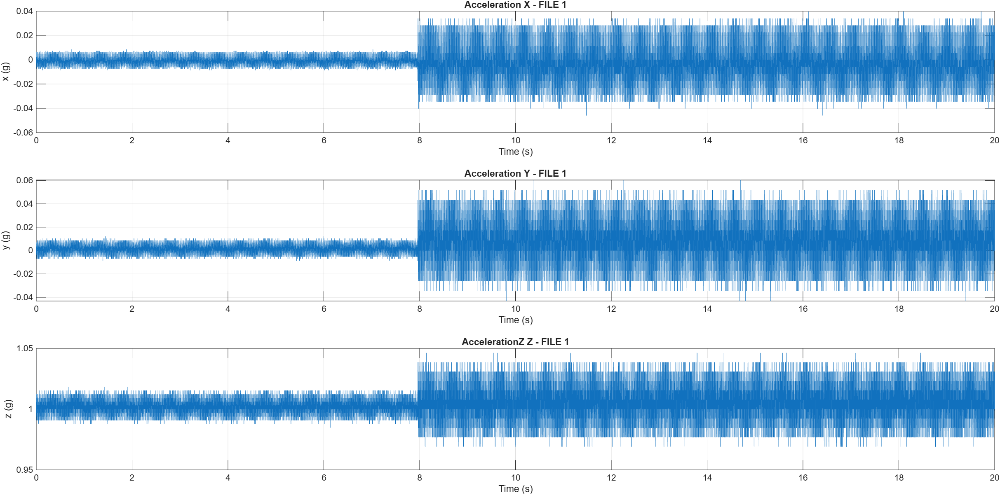

<!-- slide -->
### Dòng Điện (I1, I2, I3)
- **Giai đoạn dừng:** Ba pha gần bằng 0 A — motor chưa được cấp điện.
- **Khởi động (~8 s):** Dòng khởi động (inrush) lên tới ~2–3 A, giảm dần exponential trong ~1–2 s.
- **Trạng thái ổn định:** I1, I2, I3 dao động sin đối xứng, biên độ nhỏ (~0.1 A peak) — motor không tải tiêu thụ ít dòng.
- Ba pha **cân bằng tốt** — peak của mỗi pha gần bằng nhau.

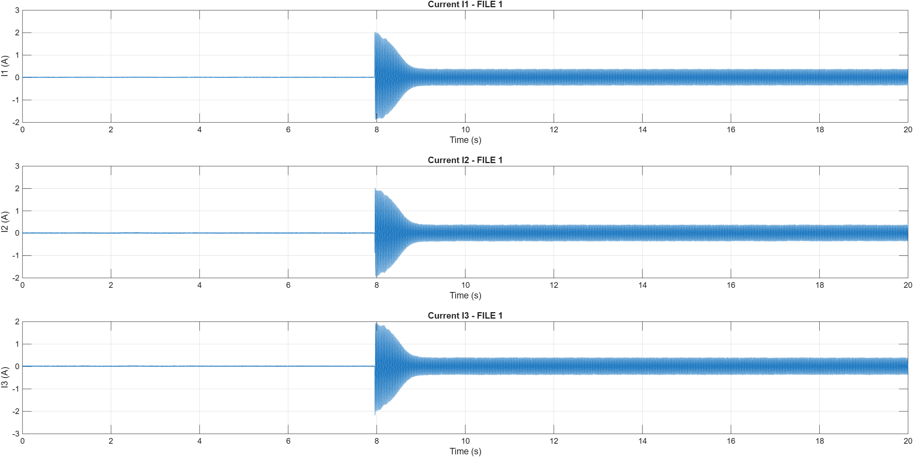

<!-- slide -->
### Điện Áp (V1, V2, V3)
- **Giai đoạn dừng:** V1, V2, V3 ≈ 0 V — chưa có điện.
- **Sau khởi động:** Điện áp sin ±380 V đầy đủ, ba pha lệch pha 120°.
- Điện áp **ổn định hoàn toàn** trong suốt thời gian vận hành — nguồn cấp chất lượng tốt.

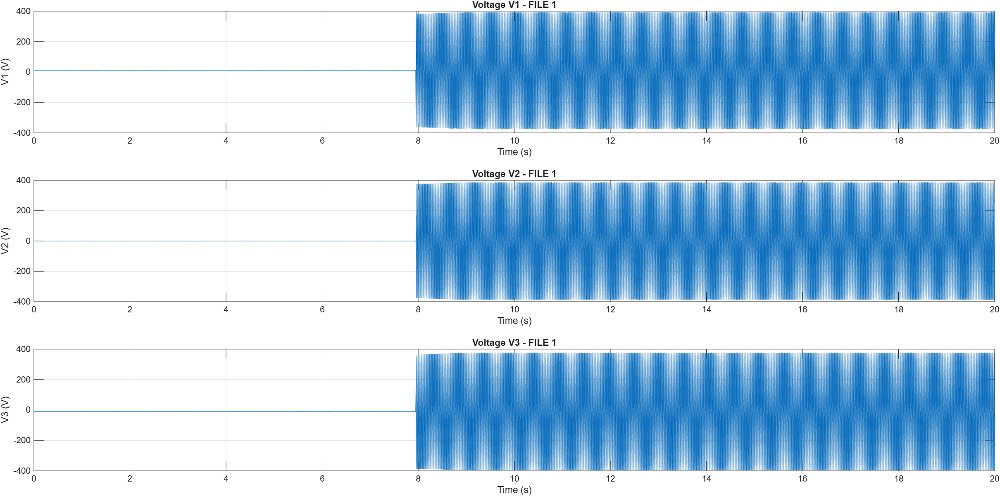
````

---

## FILE 2 — Healthy · Phase Removal During Operation (No Load)

````carousel
### Gia Tốc Rung Động
- Giai đoạn ổn định trước sự kiện: rung động tương tự F1.
- **Khi mất pha:** Rung động tăng đột ngột — mất cân bằng từ trường tạo lực hướng tâm bất đối xứng.
- Biên độ x, y tăng so với F1 sau sự kiện mất pha.

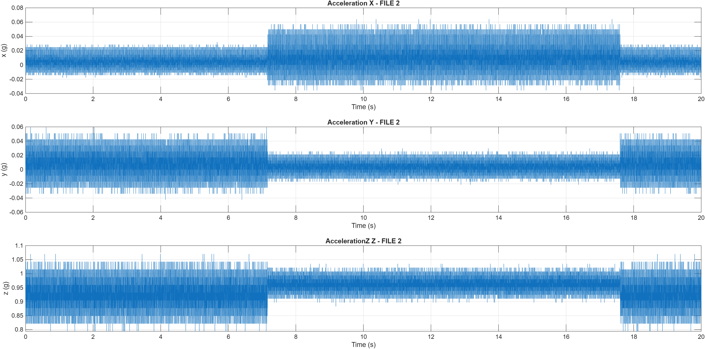

<!-- slide -->
### Dòng Điện
- Khởi động bình thường (~8 s), dòng inrush rõ ràng.
- **Sự kiện mất pha:** Một pha bị cắt → hai pha còn lại phải gánh toàn bộ tải → dòng tăng mạnh, mất đối xứng rõ rệt.
- Dạng sóng dòng điện biến dạng — không còn sin đều đặn.

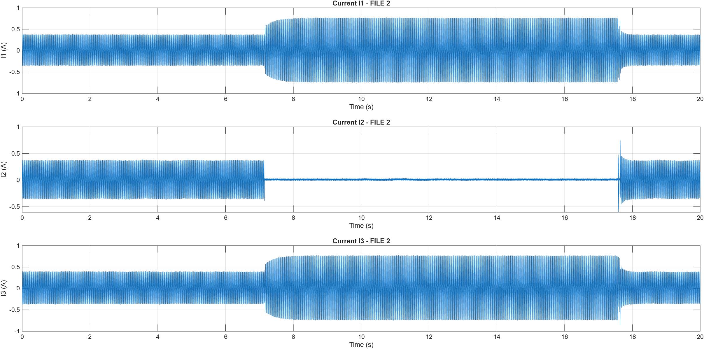

<!-- slide -->
### Điện Áp
- Điện áp lưới vẫn duy trì trên 2 pha còn lại.
- Pha bị cắt cho thấy điện áp giảm hoặc biến dạng sau sự kiện.
- Cung cấp bằng chứng trực tiếp về thời điểm và pha nào bị ngắt.

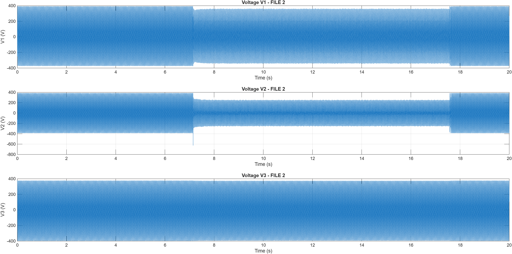
````

---

## FILE 3 — Healthy · 0.4 Nm Mechanical Load

````carousel
### Gia Tốc Rung Động
- Rung động lớn hơn F1 do tải cơ học: x dao động ±0.05 g, y ±0.07 g.
- Tín hiệu **ổn định và tuần hoàn** — đặc trưng của motor lành với tải ổn định.
- Không có xung đột biến hay modulation bất thường.

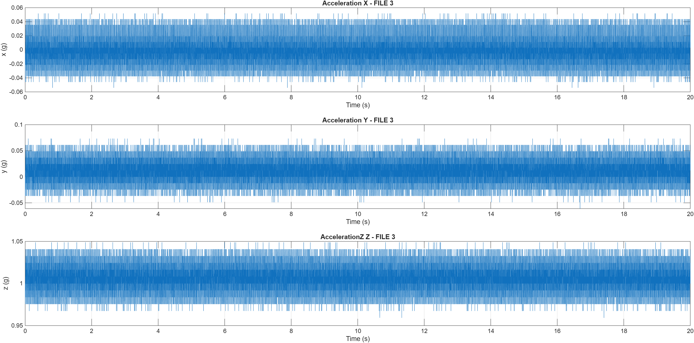

<!-- slide -->
### Dòng Điện
- Dòng ổn định cao hơn F1 (~0.44 A peak) — phản ánh tải cơ học.
- Dòng inrush khởi động rõ rệt (~8 s), giảm dần về trạng thái ổn định trong ~2 s.
- Ba pha cân bằng tốt — **đây là hành vi chuẩn** của motor lành có tải.

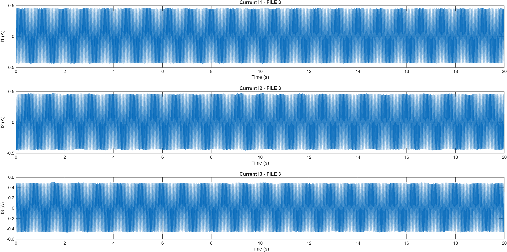

<!-- slide -->
### Điện Áp
- Điện áp lưới ổn định ±380 V, không bị ảnh hưởng bởi tải cơ.
- Ba pha hoàn toàn đối xứng, lệch 120°.

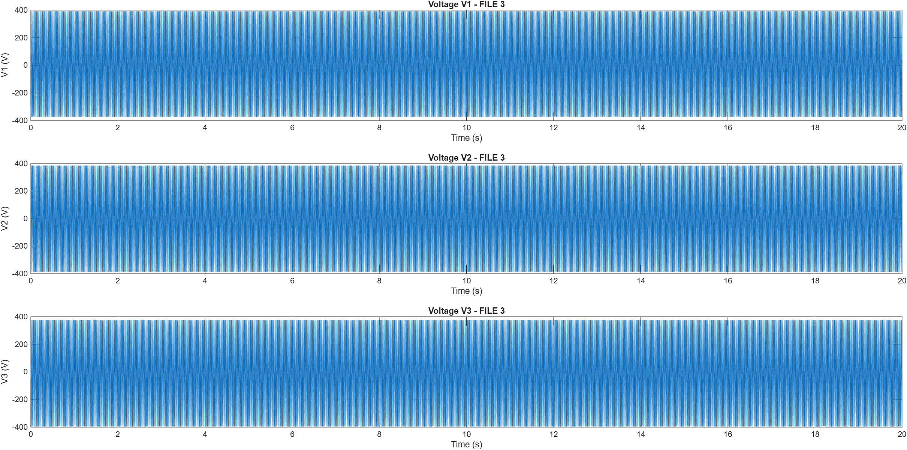
````

---

## FILE 4 — Healthy · 0.8 Nm Mechanical Load

````carousel
### Gia Tốc Rung Động
- Rung động **lớn nhất trong nhóm Healthy**: x ±0.06 g, y ±0.07 g.
- Biên độ tăng tỉ lệ với tải cơ — nhất quán với F3 (0.4 Nm).
- Tín hiệu vẫn ổn định, tuần hoàn, không có thành phần bất thường.

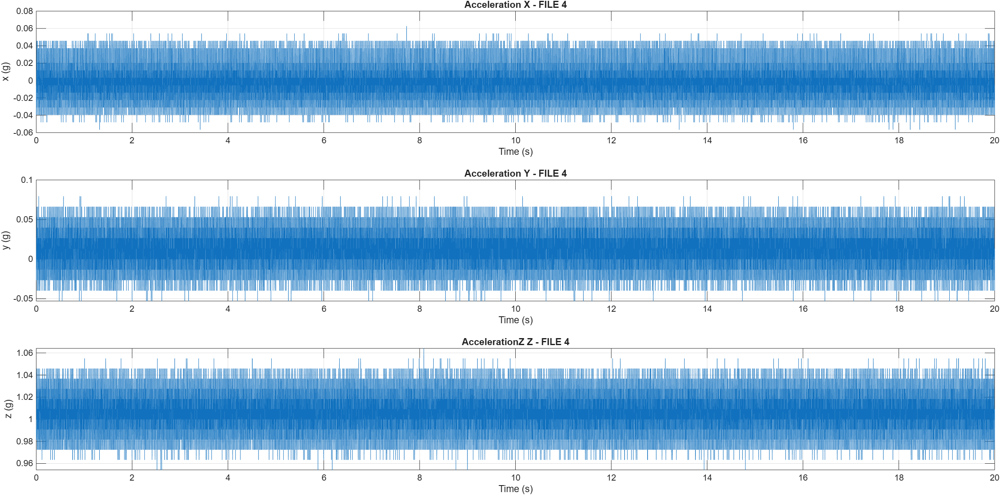

<!-- slide -->
### Dòng Điện
- Dòng peak ~0.7 A — cao nhất trong các điều kiện Healthy.
- Dòng inrush khởi động lên ~2.5 A, thời gian ổn định ~2 s.
- Dạng sóng sin đều đặn, ba pha cân bằng — **motor hoạt động tốt dù tải nặng**.

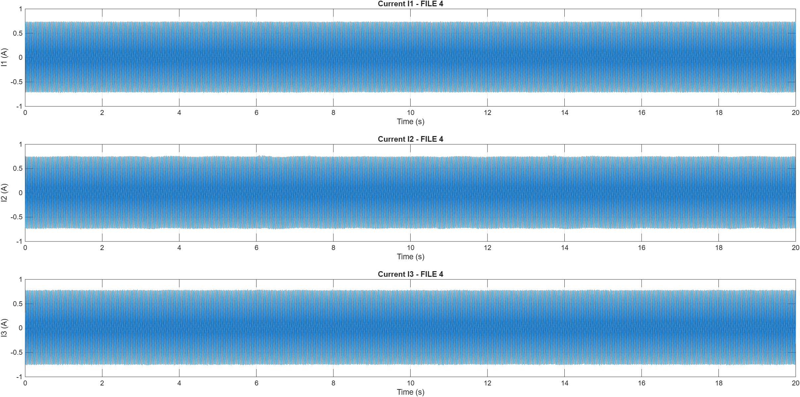

<!-- slide -->
### Điện Áp
- Điện áp lưới không thay đổi dù tải tăng gấp đôi — **nguồn cứng (stiff grid)**.
- Chứng minh rằng điện áp không phải kênh phân biệt tải cơ.

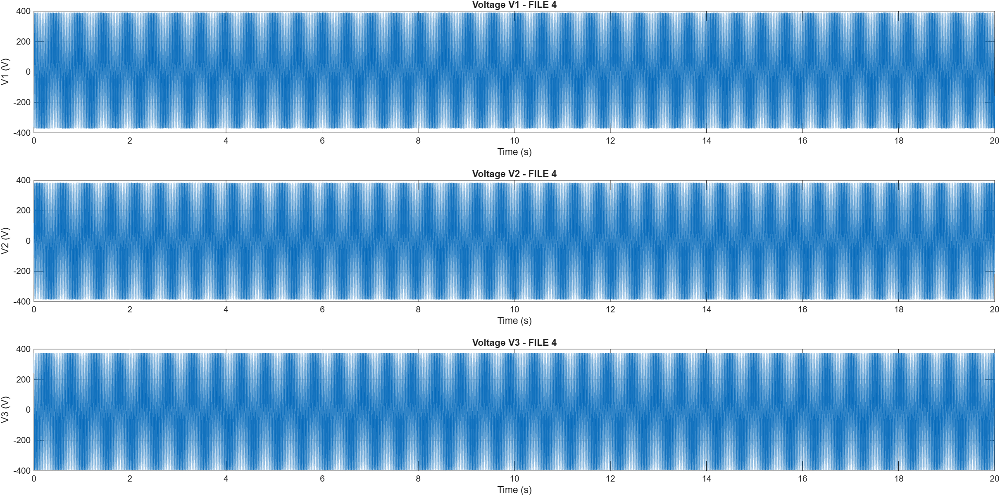
````

---

## FILE 5 — Healthy · One Phase Disconnected from Startup

````carousel
### Gia Tốc Rung Động
- **Giai đoạn dừng AND sau "khởi động":** Cả hai đều gần phẳng (~0 g).
- Motor **không tạo được từ trường quay** khi thiếu một pha → không quay → không rung.
- Đây là tín hiệu rung động **yếu nhất** trong toàn bộ dataset.

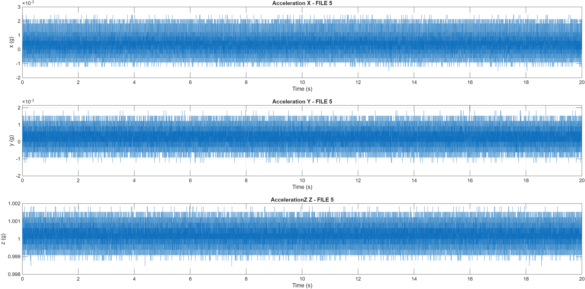

<!-- slide -->
### Dòng Điện
- Hai pha còn lại có dòng nhỏ (~0.05 A), pha bị ngắt = 0.
- **Không có dòng inrush** — motor không khởi động được.
- Biên độ dòng rất thấp, dạng sóng méo — motor cố gắng tự khởi động nhưng thất bại.

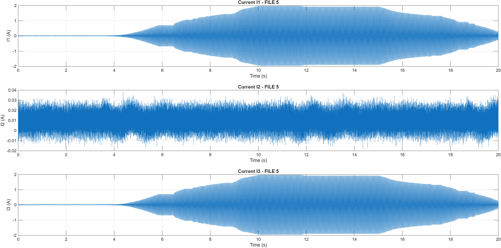

<!-- slide -->
### Điện Áp
- Hai pha có điện áp bình thường, **pha bị ngắt ≈ 0 V**.
- Đây là bằng chứng điện áp trực tiếp xác nhận điều kiện mất pha từ khởi động.

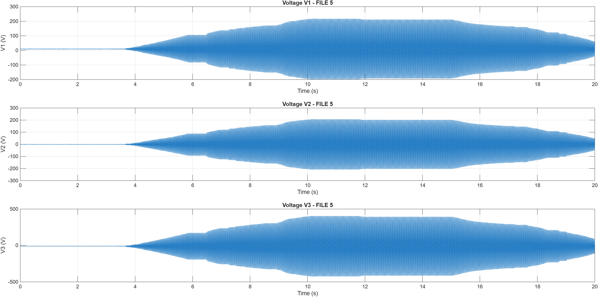
````

---

## FILE 6 — ⚠️ Faulty · Normal Operation (No Load)

````carousel
### Gia Tốc Rung Động
- **So sánh với F1 (cùng điều kiện, Healthy):** Biên độ rung động lớn hơn rõ ràng sau khởi động — x dao động ±0.05 g (F1 chỉ ±0.03 g).
- Xuất hiện thành phần **tần số cao** (nhiễu dày đặc hơn) trong tín hiệu ổn định.
- Đây là dấu hiệu sớm của **lỗi rotor** — tạo lực mất cân bằng cơ học nhỏ ngay cả khi không tải.

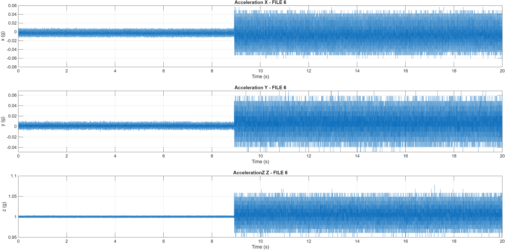

<!-- slide -->
### Dòng Điện
- Dòng inrush khởi động tương tự F1 nhưng **thời gian ổn định dài hơn**.
- Dòng ổn định có biên độ hơi cao hơn F1 — hiệu suất điện từ thấp hơn do lỗi.
- Nhìn kỹ: dạng sóng có **modulation nhỏ** (biên độ dao động không đều) — sideband đặc trưng của broken rotor bar.

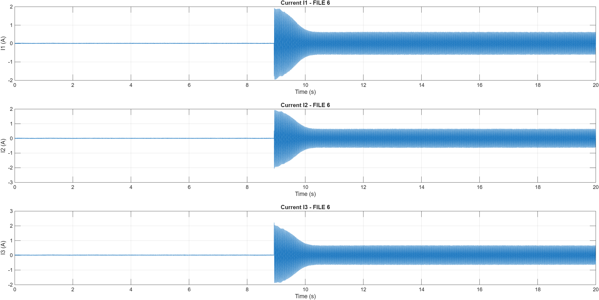

<!-- slide -->
### Điện Áp
- Điện áp không thay đổi so với F1 — **lỗi rotor không ảnh hưởng điện áp lưới**.
- Xác nhận: điện áp không phải kênh nhạy cảm với lỗi rotor.

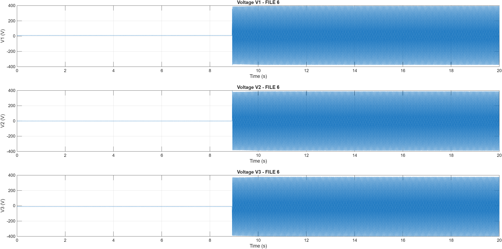
````

---

## FILE 7 — ⚠️ Faulty · Phase Removal During Operation (No Load)

````carousel
### Gia Tốc Rung Động
- Kết hợp **lỗi rotor + mất pha**: rung động cao hơn F2 (Healthy phase removal) đáng kể.
- Sau sự kiện mất pha: biên độ rung tăng mạnh, không đều — hai yếu tố mất cân bằng cộng chồng.
- Tín hiệu không còn tuần hoàn đều — bất thường rõ ràng hơn F2.

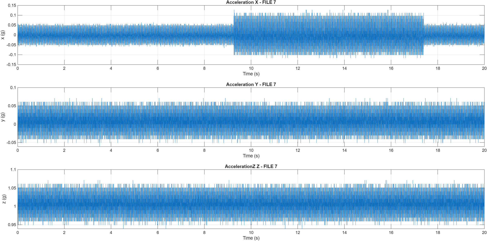

<!-- slide -->
### Dòng Điện
- Dòng cao hơn F2 tương ứng — motor lỗi cần dòng lớn hơn để tạo cùng momen.
- Mất đối xứng pha **nghiêm trọng hơn** F2 — một pha mang tải không đều.
- Dạng sóng biến dạng mạnh, có thành phần sóng hài bậc cao rõ hơn.

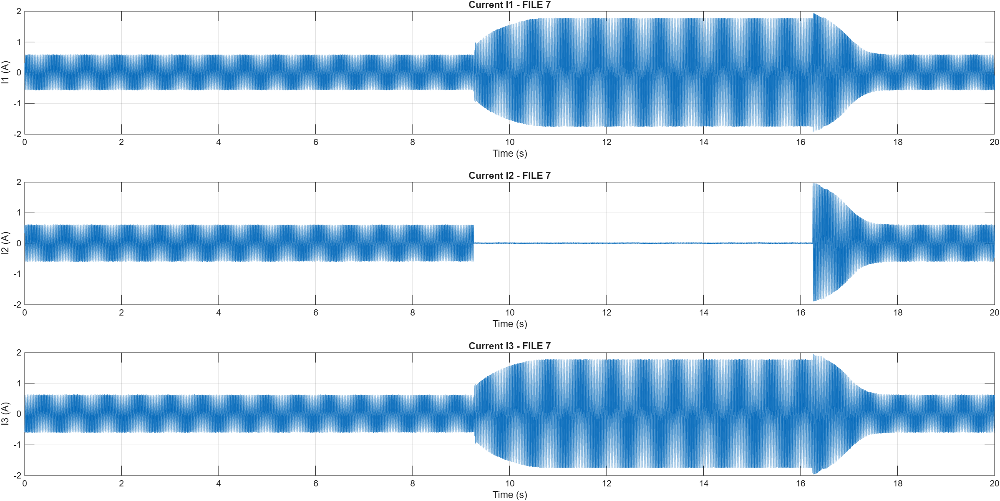

<!-- slide -->
### Điện Áp
- Pha bị cắt thể hiện rõ qua điện áp.
- Hai pha còn lại ổn định — nguồn điện không bị ảnh hưởng.

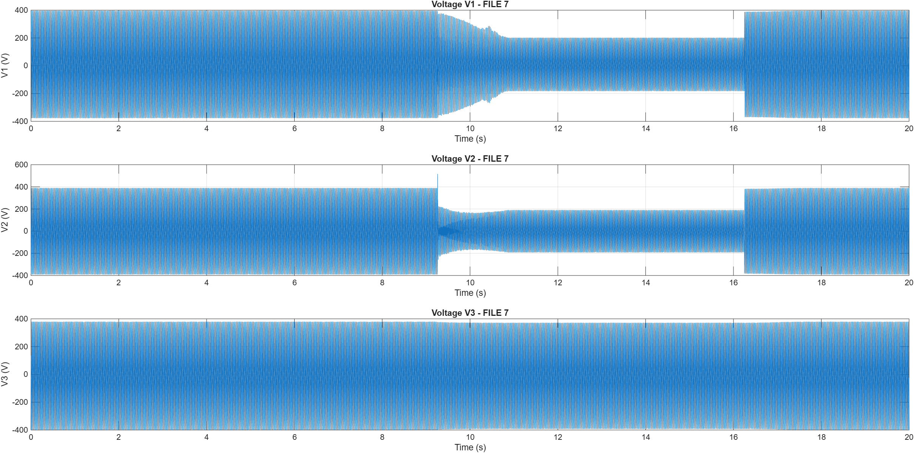
````

---

## FILE 8 — ⚠️ Faulty · 0.4 Nm Mechanical Load

````carousel
### Gia Tốc Rung Động
- **So sánh với F3 (Healthy 0.4 Nm):** Biên độ lớn hơn ~60% — lỗi rotor khuếch đại rung động khi có tải.
- Tín hiệu có dạng **không đều chu kỳ** — đặc trưng của broken rotor bar tạo modulation theo tần số trượt.
- Thành phần tần số cao dày đặc hơn F3.

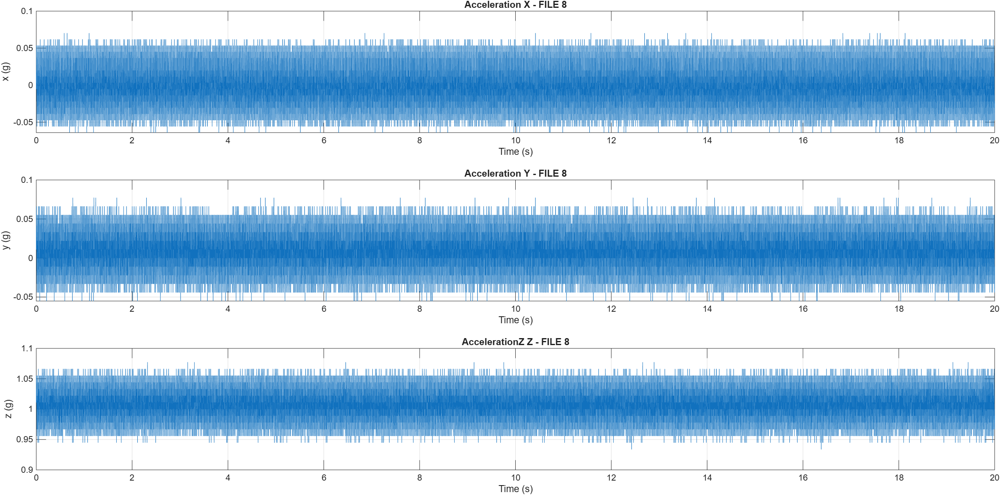

<!-- slide -->
### Dòng Điện
- Dòng RMS cao hơn F3 **~47%** — motor lỗi tiêu thụ nhiều điện hơn để duy trì cùng tốc độ/tải.
- **Modulation biên độ rõ ràng**: biên độ sin không đều → sideband broken rotor bar.
- Mất đối xứng nhỏ giữa I1, I2, I3 — không rõ bằng mắt nhưng thống kê phát hiện được.

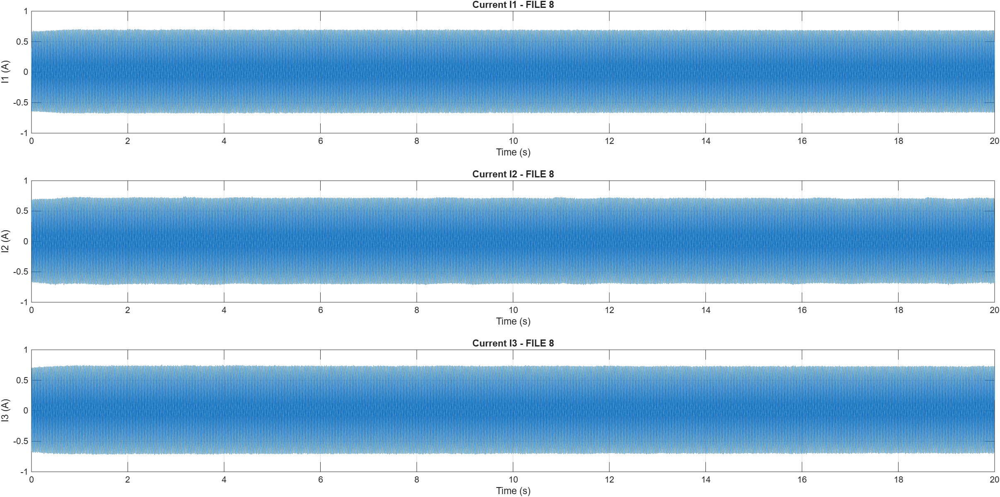

<!-- slide -->
### Điện Áp
- Điện áp ổn định, không bị ảnh hưởng — nhất quán với các file khác.

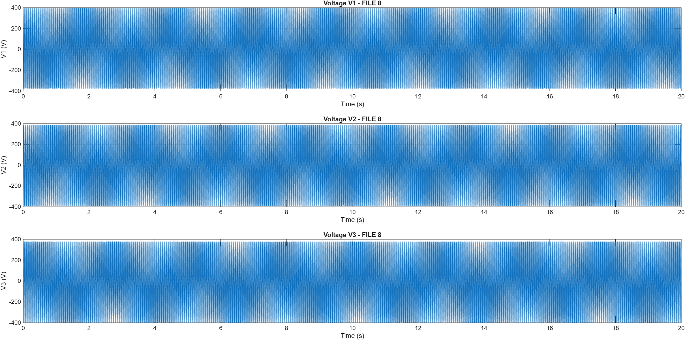
````

---

## FILE 9 — ⚠️ Faulty · 0.8 Nm Mechanical Load

````carousel
### Gia Tốc Rung Động
- **Rung động cao nhất toàn dataset**: x dao động ±0.07 g, y ±0.06 g — lớn hơn F4 (Healthy 0.8Nm) ~95%.
- Tín hiệu có **nhiều tần số chồng chập** — broken rotor bar tạo thêm nhiều thành phần harmonics cơ học.
- Giai đoạn transient khởi động kéo dài hơn so với Healthy — motor khó đạt trạng thái ổn định.

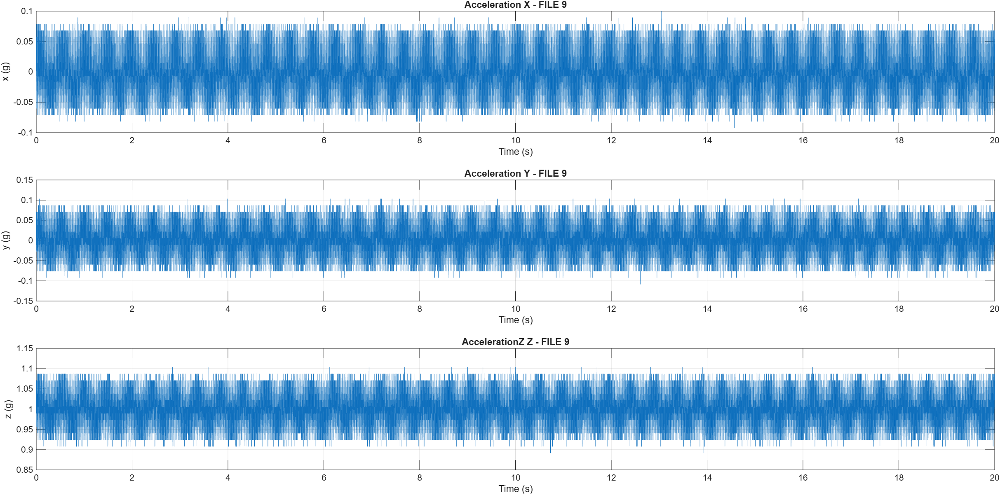

<!-- slide -->
### Dòng Điện
- Dòng peak lên đến ~1.0 A (F4 Healthy chỉ ~0.7 A) — **cao nhất trong dataset**.
- Dòng inrush khởi động cực cao (~3 A), thời gian ổn định kéo dài ~3–4 s (lâu hơn F4).
- **Modulation biên độ mạnh nhất** trong tất cả 10 file — broken rotor bar ảnh hưởng nghiêm trọng nhất khi tải nặng.

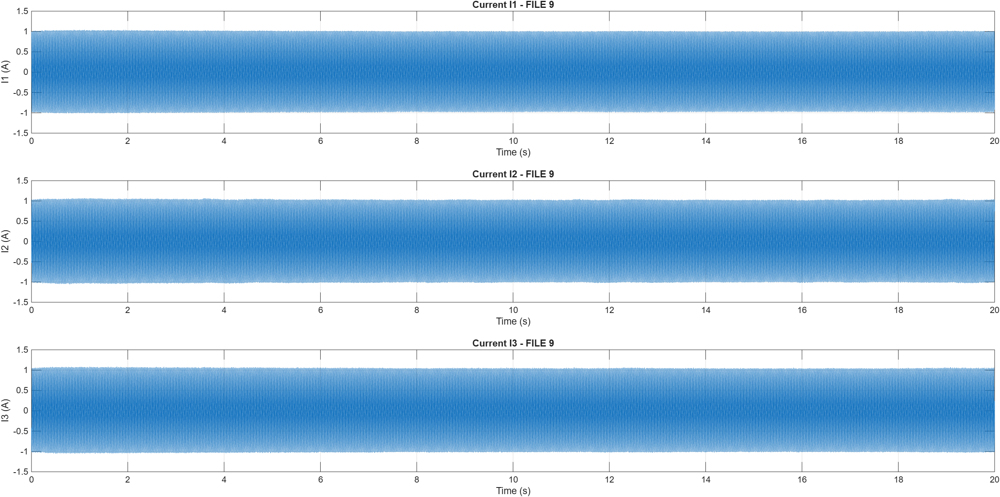

<!-- slide -->
### Điện Áp
- Điện áp ổn định ±380 V — xác nhận nguồn điện không phải nguyên nhân gây dòng cao.
- Điều này loại trừ nguồn điện yếu (voltage sag) là nguyên nhân, và khẳng định lỗi là từ phía motor.

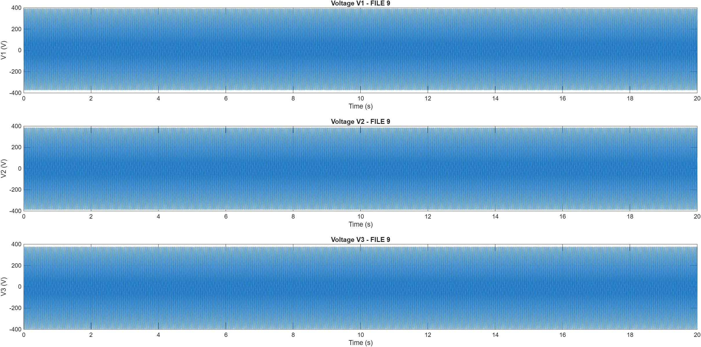
````

---

## FILE 10 — ⚠️ Faulty · One Phase Disconnected from Startup

````carousel
### Gia Tốc Rung Động
- Tương tự F5 (Healthy, 1-phase disc.): tín hiệu gần phẳng — motor không quay.
- **Khác biệt nhỏ so với F5:** Biên độ rung sau "khởi động" hơi lớn hơn một chút — rotor lỗi tạo thêm nhiễu nhỏ ngay cả khi không quay.
- Cả hai F5 và F10 đều nguy hiểm: motor bị kẹt dưới điện áp đầy đủ → tỏa nhiệt cực cao.

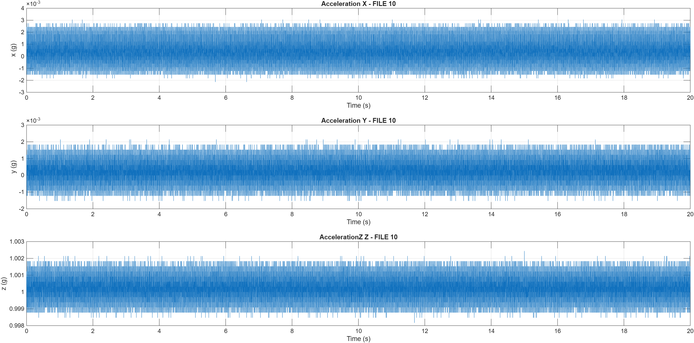

<!-- slide -->
### Dòng Điện
- Pha bị ngắt = 0 A. Hai pha còn lại mang dòng không đối xứng.
- **Mất cân bằng pha rõ hơn F5**: I2 gần 0, I1 và I3 chênh lệch — do rotor lỗi cộng thêm mất pha.
- Đây là điều kiện nguy hiểm nhất — dòng DC chạy qua cuộn dây stato khi motor không quay → nguy cơ cháy cuộn dây cao.

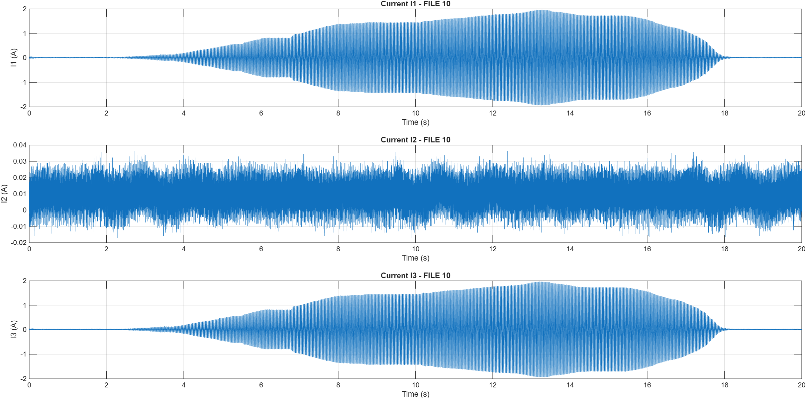

<!-- slide -->
### Điện Áp
- Pha bị ngắt: điện áp ≈ 0 V (xác nhận mất pha B).
- Hai pha còn lại duy trì điện áp đầy đủ — xác nhận lỗi là ở phía motor/cáp, không phải lưới điện.

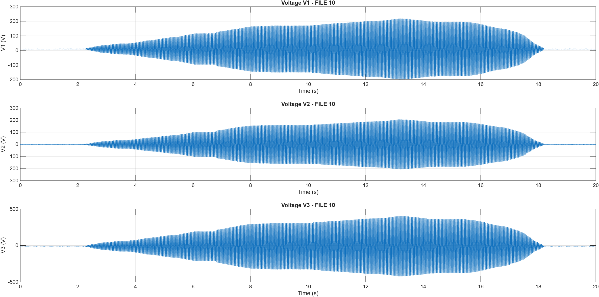
````

---

## Tóm Tắt Quan Sát Quan Trọng

### Giai đoạn khởi động (Startup Transient)
Tất cả file đều có **giai đoạn không hoạt động ~0–8 s** trước khi motor được cấp điện. Đây là thông tin quan trọng cho việc tiền xử lý dữ liệu:

> [!IMPORTANT]
> Khi xây dựng bộ đặc trưng để phân loại, **cần loại bỏ giai đoạn trước khởi động và giai đoạn transient** (~8–10 s đầu). Chỉ sử dụng phần tín hiệu **ổn định (steady-state)** để đảm bảo đặc trưng phản ánh đúng trạng thái vận hành.

### Điều chỉnh Tần Số Lấy Mẫu
> [!WARNING]
> Tần số lấy mẫu chính xác là **$f_s = 50{,}000$ Hz (50 kHz)**, không phải 12,800 Hz như đã phân tích trước đó. Điều này ảnh hưởng đến:
> - Trục thời gian trong các biểu đồ Python (đã hiển thị sai đơn vị)
> - Phân giải tần số FFT: $\Delta f = 50000/N_{FFT}$
> - Dải Nyquist: lên đến **25,000 Hz** — đủ bắt các harmonics cơ học tần số cao của vòng bi và rotor
> - Số mẫu thực tế mỗi file: **~1,000,000 mẫu** ÷ **50,000 Hz** = **~20 giây** ✅ (khớp với trục thời gian trong ảnh)

### So Sánh Cặp Healthy–Faulty (cùng điều kiện)

| Cặp | Rung động | Dòng điện | Dấu hiệu lỗi rõ nhất |
|:---:|-----------|-----------|----------------------|
| F1 vs F6 | Biên độ tăng ~68%, nhiễu HF | Modulation nhỏ | Rung động |
| F2 vs F7 | Tăng mạnh sau mất pha | Dòng cao hơn, méo hơn | Dòng điện |
| F3 vs F8 | Tăng ~60%, không đều hơn | Dòng tăng ~47%, modulation | Cả hai |
| F4 vs F9 | Tăng ~95%, nhiều thành phần | Dòng tăng ~43%, transient dài | Cả hai |
| F5 vs F10 | Gần như bằng nhau | I2 mất cân bằng rõ hơn | Dòng điện |

---

> **Vị trí ảnh gốc:** `E:\Dr Liou - Multi modal\New folder\27216219\File N_acc/cur/voltage.png`  
> **Tổng số ảnh:** 30 file (3 nhóm × 10 file)
