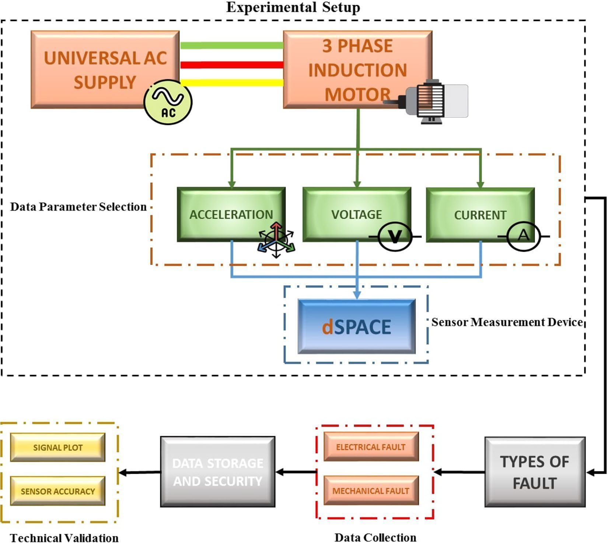
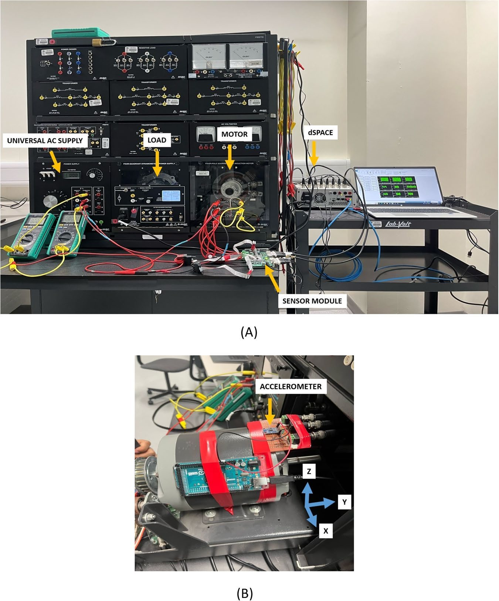
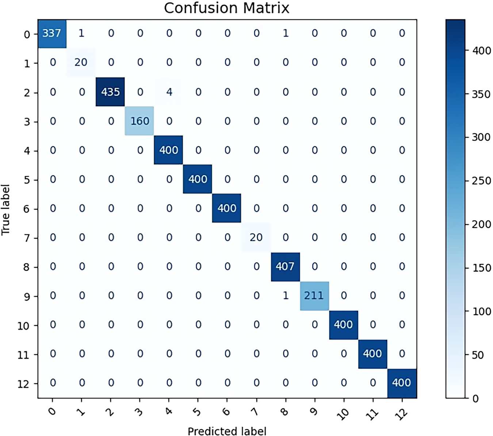

# Technical Report: Qatar Synchronized Multi-Sensor Induction Motor Dataset (Nature Scientific Data, 2025)

This concise report summarizes the key concepts, tables, and figures directly from the original paper: **"Comprehensive Fault Diagnosis of Three-Phase Induction Motors Using Synchronized Multi-Sensor Data Collection"** (Thomas et al., 2025).

> [!NOTE]
> **Dataset Abstract:** The Qatar Synchronized Induction Motor (IM) Dataset (2025) is a high-quality experimental dataset that provides hardware-synchronized real-time measurements of mechanical (3-axis vibration) and electrical (3-phase stator voltage and current) signals from an induction motor, sampled at 50 kHz. The primary objective of the dataset is to provide a benchmark for diagnosing single and coupled electromechanical faults, including outer-race bearing defects (SKF 6202-Z) and phase removal conditions (sudden phase removal during operation or phase missing from startup) under various load levels (0.0 Nm, 0.4 Nm, and 0.8 Nm).

---

## 1. Research Methodology & Experimental Setup

The research methodology and the experimental motor test bench setup are illustrated in the following figures from the paper:

### Fig. 1: Data Collection Methodology (Flowchart)

### Fig. 2: Experimental Test Bench Setup

*   **Motor:** Lab-Volt Model 8221 AC three-phase squirrel-cage induction motor (0.2 kW, 4 poles, rated speed ~1425 RPM).
*   **Loading System:** Four-Quadrant Dynamometer/Power Supply coupled to the motor to enable precise load torque control (0.0 Nm, 0.4 Nm, and 0.8 Nm).
*   **Data Acquisition (DAQ):** Real-time hardware synchronization managed via a **dSPACE** platform using BNC connections at a uniform sampling frequency of **50 kHz**.

---

## 2. Sensor Specifications & Recorded Modalities

### Table 2. List of Sensors
| Sensor Name | Unit | Description | Data Format |
| :--- | :--- | :--- | :--- |
| **Accelerometer** (ADXL335) | g | Measures linear vibrations across 3 orthogonal axes (X, Y, Z) | CSV / MAT |
| **Voltage Sensor** | V | Monitors parallel 3-phase stator voltage fluctuations | CSV / MAT |
| **Current Sensor** | A | Monitors series 3-phase stator current fluctuations | CSV / MAT |

---

## 3. Operational Scenarios & Fault Category Mapping

Measurements were conducted using **two identical physical motors**: one healthy and one faulty (bearing fault introduced by drilling outer-race holes on an SKF 6202-Z bearing using Electrical Discharge Machining - EDM).

### Table 3. Operational Conditions and corresponding motor speeds
| File No. | Condition Description | Motor Type | Speed (r/min) |
| :--- | :--- | :--- | :--- |
| **File 1** | Normal Operation (No Load) | Healthy | 1428 |
| **File 2** | Phase Removal During Operation (No Load) | Healthy | 1366 |
| **File 3** | Operation Under 0.4 Nm Load | Healthy | 1389 |
| **File 4** | Operation Under 0.8 Nm Load | Healthy | 1260 |
| **File 5** | Running with One Phase Disconnected from Startup | Healthy | 0 |
| **File 6** | Normal Operation (No Load) | Faulty | 1311 |
| **File 7** | Phase Removal During Operation (No Load) | Faulty | 1254 |
| **File 8** | Operation Under 0.4 Nm Load | Faulty | 1279 |
| **File 9** | Operation Under 0.8 Nm Load | Faulty | 1101 |
| **File 10**| Running with One Phase Disconnected from Startup | Faulty | 0 |

---

### Table 4. 13 Classification Categories (Fault Category Labels)
The pre-segmented dataset (`LABEL DATASET.csv` consisting of **19,982 samples**, each with a window length of 10,000 features) maps to 13 health classes:

| Class Label | Fault Classification Category |
| :--- | :--- |
| **1** | Motor Off (No Operation State) |
| **2** | Faulty Motor During Startup |
| **3** | Faulty Motor in Normal Operation |
| **4** | Faulty Motor – Phase Removed During Running |
| **5** | Faulty Motor – No Phase From Startup |
| **6** | Healthy Motor During Startup |
| **7** | Healthy Motor in Normal Operation |
| **8** | Healthy Motor – Phase Removed During Running |
| **9** | Healthy Motor – No Phase From Startup |
| **10** | Faulty Motor Under 0.4 Nm Load |
| **11** | Faulty Motor Under 0.8 Nm Load |
| **12** | Healthy Motor Under 0.4 Nm Load |
| **13** | Healthy Motor Under 0.8 Nm Load |

---

## 4. Baseline Machine Learning Performance

In the original study, standard time-domain and frequency-domain statistical features were extracted and evaluated using a **Random Forest (RF)** classifier to establish a baseline for the 13-class fault classification task.

### Table 5. Performance of the Baseline Machine Learning Model (Random Forest)
| Metric | Value |
| :--- | :--- |
| **Accuracy** | 99.82% |
| **Precision** | 0.9982 |
| **Recall** | 0.9982 |
| **F1 Score** | 0.9983 |

### Fig. 15: Confusion Matrix of the baseline Random Forest classifier

---

## 5. Key Scientific Conclusions
*   **Hardware Synchronization:** The dataset's unique value lies in its high-resolution, hardware-synchronized acquisition across heterogeneous modalities (mechanical vibration and electrical current/voltage), eliminating clock drift issues and enabling robust cross-modal fusion.
*   **Transient Regime Exploration:** Gaining access to transient signatures (startup phase and sudden in-operation phase removals) enables the validation of change-point detection and real-time fault tracking algorithms.
*   **Key Limitations:** Lack of speed variation (steady power supply frequency fixes the speed range) and limited bearing defect variability (only outer-race defects are present).
