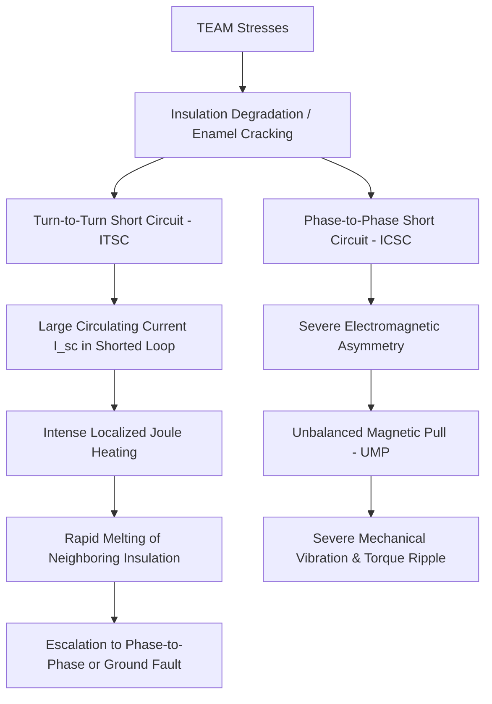
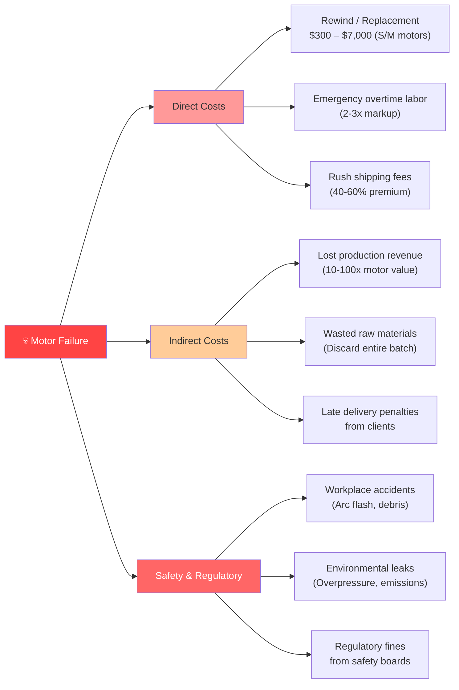

# 🔌 Comprehensive Technical Report
## Electric Motors: Importance, Risks, Failure Consequences, and Technical Challenges in Fault Diagnosis

| Field | Information |
|---|---|
| **Report Type** | Comprehensive Technical Survey & Theoretical Analysis |
| **Domain** | Electrical Machines, Condition Monitoring, Predictive Maintenance, Intelligent Fault Diagnosis |
| **Target Audience** | HUST Researchers, Postgraduate Students, Drive System Engineers |
| **Synthesized From** | Literature in *Multi-Modal PHM Research Directory — Dr. Liou* |
| **Date** | June 2026 |

---

## 📋 Abstract

Electric motors are the mechanical backbone of modern industrial civilization, converting the majority of global electrical energy into mechanical work across nearly every productive sector. However, they are subject to a wide range of complex, progressive physical degradation mechanisms. This report provides an in-depth analysis of: **(1)** the industrial importance of electric motors in global energy consumption [1]; **(2)** the detailed physical mechanisms of various faults (how they fail), including bearing defects (BPFO, BPFI, BSF, FTF) [1, 10], stator winding short circuits (ITSC, ICSC) [4, 7], broken rotor bars (BRB) [10], air-gap eccentricity [5], shaft misalignment [1], and mechanical looseness [16]; **(3)** the economic and operational consequences when failures occur [1]; **(4)** the critical role of early condition monitoring and the PHM framework [2]; and **(5)** the deep technical bottlenecks that make generalized fault diagnosis an ongoing research challenge [14, 17] along with SOTA deep learning architectures for multi-modal fusion [15].

---

## 📌 Table of Contents

1. [Introduction](#1-introduction)
2. [Importance of Electric Motors](#2-importance-of-electric-motors)
   - 2.1 [Global Energy Statistics](#21-global-energy-statistics)
   - 2.2 [Applications by Sector and Technology Market Share](#22-applications-by-sector-and-technology-market-share)
3. [Physical Mechanisms of Faults (How They Fail)](#3-physical-mechanisms-of-faults-how-they-fail)
   - 3.1 [Statistical Distribution of Faults](#31-statistical-distribution-of-faults)
   - 3.2 [Physical Mechanisms of Specific Faults](#32-physical-mechanisms-of-specific-faults)
     - 3.2.1 [Bearing Faults](#321-bearing-faults)
     - 3.2.2 [Stator Winding Faults: Turn-to-Turn (ITSC) vs. Coil-to-Coil (ICSC)](#322-stator-winding-faults-turn-to-turn-itsc-vs-coil-to-coil-icsc)
     - 3.2.3 [Broken Rotor Bars (BRB)](#323-broken-rotor-bars-brb)
     - 3.2.4 [Air-Gap Eccentricity](#324-air-gap-eccentricity)
     - 3.2.5 [Shaft Misalignment and Bent Shaft](#325-shaft-misalignment-and-bent-shaft)
     - 3.2.6 [Mechanical Looseness](#326-mechanical-looseness)
4. [Consequences of Motor Failures](#4-consequences-of-motor-failures)
   - 4.1 [Downtime Analysis](#41-downtime-analysis)
   - 4.2 [Comprehensive Cost Analysis](#42-comprehensive-cost-analysis)
5. [The Critical Importance of Early Fault Detection](#5-the-critical-importance-of-early-fault-detection)
   - 5.1 [PHM (Prognostics & Health Management) Framework](#51-phm-prognostics--health-management-framework)
   - 5.2 [Intervention Window and Fault Evolution](#52-intervention-window-and-fault-evolution)
6. [Multi-Modal Coupling Mechanisms](#6-multi-modal-coupling-mechanisms)
   - 6.1 [Mechanical to Electrical: Current Modulation (MCSA)](#61-mechanical-to-electrical-current-modulation-mcsa)
   - 6.2 [Electrical to Mechanical: Unbalanced Magnetic Pull (UMP)](#62-electrical-to-mechanical-unbalanced-magnetic-pull-ump)
7. [Sensitivity Heatmap and Feature Signature Cross-Reference](#7-sensitivity-heatmap-and-feature-signature-cross-reference)
8. [Why Motor Fault Diagnosis is Challenging (Technical Bottlenecks)](#8-why-motor-fault-diagnosis-is-challenging-technical-bottlenecks)
   - 8.1 [Detailed Analysis of 10 System Challenges](#81-detailed-analysis-of-10-system-challenges)
   - 8.2 [Comparison of Diagnostic Methods](#82-comparison-of-diagnostic-methods)
9. [SOTA Multi-modal Deep Fusion Architectures](#9-sota-multi-modal-deep-fusion-architectures)
   - 9.1 [PHM Technology Roadmap](#91-phm-technology-roadmap)
   - 9.2 [SOTA Multi-modal Deep Fusion Networks](#92-sota-multi-modal-deep-fusion-networks)
   - 9.3 [Key Research Publications Summary](#93-key-research-publications-summary)
10. [Critical Assessment and Strategic Research Directions](#10-critical-assessment-and-strategic-research-directions)
    - 10.1 [Critical Assessment of Deep Learning in Motor Diagnostics](#101-critical-assessment-of-deep-learning-in-motor-diagnostics)
    - 10.2 [Five Unresolved Challenges (2025)](#102-five-unresolved-challenges-2025)
    - 10.3 [Proposed Strategic Research Directions](#103-proposed-strategic-research-directions)
    - 10.4 [Simulation & Experimental Verification Design](#104-simulation--experimental-verification-design)
11. [Conclusion & Key Takeaways](#11-conclusion--key-takeaways)
    - 11.1 [Conclusion](#111-conclusion)
    - 11.2 [Key Takeaways](#112-key-takeaways)
12. [References](#12-references)

---

## 1. Introduction

Electric motors are electromechanical devices that convert electrical energy into mechanical energy through the interaction of magnetic fields and current-carrying conductors. Since their inception in the 19th century, they have evolved from laboratory curiosities into the primary driver of industrial manufacturing, transportation, energy conversion, and infrastructure operations. Today, **three-phase induction motors (IM)**, **permanent magnet synchronous motors (PMSM)**, and **brushless DC (BLDC) motors** are present in almost every factory, vehicle, utility system, and household appliance worldwide [2].

Despite their apparent simplicity and robustness, electric motors are complex physical systems operating under continuous electrical, thermal, mechanical, and environmental stresses. Mechanical wear accumulates in bearings [1, 10]; thermal cycles degrade stator winding insulation [4]; electromagnetic asymmetry induces rotor eccentricity [5]; and transient overloads cause rotor bar cracking [10]. These degradation processes are typically **progressive** — starting as micro-defects and advancing over weeks or years — before manifesting as catastrophic failures.

> [!IMPORTANT]
> If left undetected, latent faults escalate into catastrophic failures, resulting in severe economic losses, operational downtime, and safety hazards [1].

This reality has driven decades of research into **condition monitoring (CM)** and **fault diagnosis** — spanning classical Fourier analysis of vibration and Motor Current Signature Analysis (MCSA) [10], to data-driven machine learning, and recently, deep learning architectures that learn features directly from raw sensor signals [15]. However, achieving generalized, robust, and explainable fault diagnosis in diverse industrial settings remains an open scientific and engineering challenge [14, 17].

---

## 2. Importance of Electric Motors in Industry

### 📊 2.1 Global Energy Statistics

Electric motors are the single largest consumer of electricity in the global economy. According to the International Energy Agency (IEA 4E EMSA - 2025), electric motor-driven systems (MDS) account for approximately **53% of global electricity consumption** [29]. This underscores their central role in both energy demand and carbon emission reduction strategies.

The global distribution of electricity end-use and the sector-specific shares of electricity consumed by motor systems are illustrated below:

![Figure 7: Global electricity end-use share and motor share of electricity by sector (Source: IEA 4E EMSA 2025) [1]](figures/motor_energy_use_en.png)

The following table summarizes key energy statistics and the operational scale of electric motors:

| Indicator | Value | Detailed Sector / Context | Data Source |
|---|---|---|---|
| **Global Electricity Consumption Share** | **53%** | All electric motor-driven systems (MDS) combined | IEA 4E EMSA 2025 [29] |
| **Electricity Share in Industry** | **72%** | Drives for pumps, fans, compressors, conveyors, machine tools | IEA 4E EMSA 2025 [29] |
| **Electricity Share in Agriculture** | **87%** | Irrigation pumps, grinders, agricultural processing machinery | IEA 4E EMSA 2025 [29] |
| **Electricity Share in Transportation** | **86%** | Electric Vehicles (EVs), high-speed rail, subways | IEA 4E EMSA 2025 [29] |
| **Electricity Share in Buildings** | **36%** | HVAC systems, elevators, water pumps, cooling compressors | IEA 4E EMSA 2025 [29] |
| **Industrial Rotating Equipment Share** | **85%** | Squirrel-cage induction motors (IM) | Bangash et al. [2] |
| **IEEE 493 Survey Sample** | **~1,141 large motors** | 304 recorded failures across multi-site industrial survey | IEEE Std 493-2007 Appendix H [30] |

---

### 🏭 2.2 Applications by Sector and Technology Market Share

Electric motors drive a vast array of systems, ranging from low-power consumer applications to heavy industrial machinery and modern transport traction systems.

The electricity consumption by load application type in Motor-Driven Systems (MDS) and the global market shares of primary motor technologies (Induction Motors, PMSMs, and others like BLDC, DC, EESM) are shown below:

![Figure 9: MDS electricity consumption by application (IEA) and motor technology market share by domain [29]](figures/motor_applications_and_market_share_en.png)

#### 1. Electricity Consumption by Application Type (MDS End-Use) [29]:
*   **Turbomachinery Systems (Pumps, Fans, Compressors):** These account for **70% of all motor-system energy usage** (representing roughly 37% of global electricity consumption).
    *   **Compressors:** Consume **32%** of motor energy. This includes industrial air compressors, commercial refrigeration, and cooling compressors in HVAC systems.
    *   **Pumps:** Consume **19%** of motor energy. These are critical in water treatment plants, cooling water circulation loops, and chemical/petroleum pipelines.
    *   **Fans:** Consume **19%** of motor energy. These drive industrial blowers, boiler exhaust fans, ventilation systems, and cooling towers.
*   **Mechanical Movement Systems:** Consume **30% of motor energy**. This encompasses material handling conveyors, elevators, mills, mixers, crushers, and CNC machining spindles.

#### 2. Motor Technology Market Share by Domain [1, 2]:
Industrial decarbonization and efficiency mandates (IE4/IE5 standards) are reshaping the market distribution of motor technologies:
*   **Industrial Domain (Sales Volume and Installed Base):**
    *   **AC Induction Motors (IM):** Command **70%** of the installed base and approximately 45% of global market revenue. Due to their low cost, robust construction, and direct-on-line (DOL) operating capability, squirrel-cage induction motors remain the workhorse for standard pumps, fans, and conveyors.
    *   **Permanent Magnet Synchronous Motors (PMSM):** Account for **10%** of the industrial market but represent the fastest-growing segment (CAGR ~10-11%). PMSMs are crucial for meeting IE5 efficiency requirements and driving high-precision machinery (e.g., servo drives in CNCs and robotics).
    *   **Others (BLDC, DC, SRM):** Account for **20%** of the market, primarily in light automation, consumer appliances, and legacy speed-controlled DC drives.
*   **EV Transportation Domain (Traction Motors):**
    *   **PMSM:** Dominates with approximately **70%** of the electric vehicle traction market. PMSMs are preferred in passenger EVs due to their superior torque-to-weight ratio, high power density, and high efficiency in urban stop-and-go driving profiles.
    *   **AC Induction Motors (IM):** Account for **18%** of the traction market. They are commonly used as auxiliary motors on secondary axles (e.g., in dual-motor AWD systems) because they do not suffer from magnetic drag (no back-EMF) when unexcited during highway cruising.
    *   **Others (EESM - Electrically Excited Synchronous Motor, SRM):** Account for **12%** of the market. Automakers like BMW and Renault use EESMs to eliminate dependencies on rare-earth permanent magnets.

---

## 3. Physical Mechanisms of Faults (How They Fail)

### 📊 3.1 Statistical Distribution of Faults (IEEE Std 493-2007 vs. Modern Academic Consensus 2020-2026)

Developing an effective predictive maintenance (PdM) strategy requires understanding the statistical probability of failures across different motor subcomponents. Modern research utilizes standardized statistics from the **IEEE Std 493-2007 (IEEE Gold Book)** [30] combined with **Modern Academic Consensus (2020-2026)** [14, 15] obtained from large-scale surveys. Note: IEEE Std 493-2007 was based on a survey of approximately 1,141 large motors across multiple industrial installations (304 recorded failures); it has since been superseded by IEEE Std 3006.8-2018, though its fault distribution data remains widely referenced.

The chart below compares the failure distribution from these sources:

![Figure 8: Comparison of Motor Fault Distribution: IEEE Std 493-2007 vs. Academic Consensus (2020-2026) [30, 14, 15]](figures/motor_fault_statistics_en.png)

The table below provides a detailed breakdown of failure categories, physical causes, and optimal diagnostic modalities [30, 2]:

| Fault Category (Component) | IEEE Std 493 Share (%) | Academic Consensus (2020-2026) (%) | Primary Degradation & Physical Mechanisms | Most Sensitive Sensor Channel |
|---|---|---|---|---|
| **Bearing Faults** | **51%** | **50% – 60%** | Subsurface Hertzian fatigue, lubrication starvation, abrasive wear, shaft EDM currents causing fluting [8, 10] | Vibration (acceleration) [30, 10], Acoustic Emission (AE) [10], Temperature |
| **Stator Winding Faults**| **25%** | **25% – 30%** | Insulation degradation due to TEAM stresses, turn-to-turn (ITSC) or coil-to-coil (ICSC) short circuits [4, 7] | Negative-sequence current [11], Leakage flux [12], Partial Discharge [4] |
| **Shaft / Coupling Faults**| **6%** | **5% – 10%** | Parallel/angular misalignment, dynamic imbalance, shaft bending, fatigue cracking [30] | Vibration (displacement/velocity at $1f_r, 2f_r$) [30] |
| **Rotor / Bar Faults** | **3%** | **3% – 5%** | Broken rotor bars (BRB), end-ring cracking due to startup thermal stress and cyclic Lorentz forces [10] | Stator current (MCSA sidebands $(1\pm2s)f_s$) [10] |
| **Others & External** | **15%** | **10% – 15%** | Power supply anomalies (phase imbalance, harmonics), environmental contamination, overload | Power quality monitoring [13], Temperature, Current |

#### In-Depth Analysis of Failure Distribution Shifts in Modern Industry [30, 14, 15]:

1.  **VFD Impact on Bearing Failures:**
    *   In the **IEEE Std 493-2007** survey (Appendix H, ~1,141 motors sampled), bearing failures represent **51%** of all faults. Modern consensus elevates this to **50% - 60%**.
    *   The primary driver is the widespread adoption of variable frequency drives (VFDs). High-frequency common-mode voltages from VFDs induce capacitive shaft currents that discharge through the bearing oil film (EDM currents). This micro-arcing melts the metal, creating parallel fluting ridges along the raceways, leading to rapid bearing degradation compared to classic mechanical wear.
2.  **Stator Fault Voltage Level Discrepancies:**
    *   Stator winding failures average **25%** across general motor installations.
    *   However, in medium-voltage (MV) and high-voltage (HV) motors ($3.3\text{ kV}$ to $11\text{ kV}$) used in heavy industry (refinery, chemical, mining), stator faults can exceed **35% - 40%**. High electric field stresses initiate partial discharges (PD) in stator slot voids, accelerating insulation failure.
3.  **Low Rotor Fault Share but High Consequential Damage:**
    *   Rotor faults account for only **3% - 5%** of failures. However, they cause severe secondary damage. A broken rotor bar (BRB) induces dynamic eccentricity, creating Unbalanced Magnetic Pull (UMP) that damages bearings and stator cores.

---

### 🔍 3.2 Physical Mechanisms of Specific Faults

#### 3.2.1 Bearing Faults

##### Physical Mechanisms [1, 6]:
Bearings support the radial and axial loads of the rotating shaft. Mechanical failure typically progresses through the following physical stages:
1.  **Subsurface Hertzian Contact Fatigue:** Repetitive compressive stresses at the contact point between the rolling elements and the races induce micro-cracks beneath the metal surface. These micro-cracks eventually propagate to the surface, causing microscopic pitting.
2.  **Spalling/Flaking:** As micro-cracks coalesce, small flakes of metal break away from the raceway or rolling elements, creating localized, sharp physical defects.
3.  **Lubrication Failure:** Dislodged metallic particles act as abrasive contaminants. They break down the thin elastohydrodynamic lubrication (EHL) film, increasing metal-to-metal contact, localized friction, and operating temperatures, which accelerates wear.
4.  **EDM Currents:** In motors driven by Variable Frequency Drives (VFDs), high-frequency common-mode voltages induce currents that flow through the bearing oil film. This micro-arcing melts the metal surface, creating parallel fluting ridges along the raceways, leading to rapid bearing destruction.

When a rolling element strikes a localized raceway defect, it generates a high-frequency, periodic mechanical shock. The repetition frequency of these impacts is determined by the bearing geometry and shaft speed:

![Figure 1: Bearing geometry and parameters ($d, D, \alpha$) for characteristic frequency calculation [10]](figures/bearing_fault_frequencies_en.png)

The characteristic bearing defect frequencies are calculated using the following equations [10]:

*   **Ball Pass Frequency Outer Race (BPFO):**
    $$f_{BPFO} = \frac{N_b}{2} f_r \left(1 - \frac{d}{D}\cos\alpha\right)$$
*   **Ball Pass Frequency Inner Race (BPFI):**
    $$f_{BPFI} = \frac{N_b}{2} f_r \left(1 + \frac{d}{D}\cos\alpha\right)$$
*   **Ball Spin Frequency (BSF):**
    $$f_{BSF} = \frac{D}{2d} f_r \left(1 - \left(\frac{d}{D}\cos\alpha\right)^2\right)$$
*   **Fundamental Train Frequency (FTF - Cage Frequency):**
    $$f_{FTF} = \frac{1}{2} f_r \left(1 - \frac{d}{D}\cos\alpha\right)$$

Where:
*   $f_r$: Shaft rotational frequency (Hz).
*   $N_b$: Number of rolling elements (balls).
*   $d$: Rolling element (ball) diameter.
*   $D$: Pitch diameter.
*   $\alpha$: Contact angle.

---

#### 3.2.2 Stator Winding Faults: Turn-to-Turn (ITSC) vs. Coil-to-Coil (ICSC)

Stator winding insulation degradation is driven by the synergistic action of four stresses, known as the **TEAM** factors (Thermal, Electrical, Ambient, and Mechanical) [4].

##### Physical Mechanisms [4, 11]:

1.  **Thermal Stress and Cycling:** Continuous overload or startup thermal surges generate high heat. The differential thermal expansion between copper windings and the steel stator core creates mechanical shear stresses that crack the thin enamel coating. By Arrhenius' law, insulation life halves for every $10^\circ C$ operation above the limit of the insulation class.
2.  **Lorentz Forces:** Alternating current interacts with the magnetic field to produce Lorentz forces, causing micro-vibrations at twice the supply frequency ($2f_s$) that wear down the insulation coating over time.
3.  **High dv/dt Voltage Surges:** High-frequency PWM voltage pulses from variable frequency drives (VFDs) have extremely steep rise times ($dv/dt > 10\ \text{kV}/\mu\text{s}$). Transmission line wave reflection causes voltage spikes concentrated at the first few turns of the winding, initiating Partial Discharge (PD) that destroys the insulation.

##### Comparison between ITSC and ICSC [4, 11, 13]:
*   **Inter-turn Short Circuit (ITSC):** Occurs within the **same coil**. When insulation between adjacent turns fails, a closed short-circuited loop is formed. The induced electromotive force in the loop ($E_{loop}$) is small, but because the loop resistance ($R_{loop}$) is extremely low, the circulating current ($I_{sc}$) is huge:
    $$I_{sc} = \frac{E_{loop}}{R_{loop} + j\omega L_{loop}}$$
    This circulating current can reach **5 to 10 times** the motor's rated current, causing intense localized Joule heating ($P = I_{sc}^2 R_{loop}$). The temperature at the short circuit point rapidly exceeds $200^\circ\text{C} - 300^\circ\text{C}$, melting neighboring insulation and destroying the motor within seconds or minutes.
*   **Inter-coil Short Circuit (ICSC):** Occurs between **different coils** in the same phase or between different phases. ICSC abruptly reduces the effective turns of the affected phase ($N_{eff} \ll N_{nominal}$). This causes severe electromagnetic asymmetry, generating **Unbalanced Magnetic Pull (UMP)** on the rotor. The UMP bends the shaft, overloads the bearings, and creates large torque ripples at the grid frequency and its harmonics:
    $$T_{ripple} \propto I_a^2 + I_b^2 + I_c^2 \quad (\text{under unbalanced current conditions})$$

The equivalent circuit diagram of these stator faults is shown below:

![Figure 3: Equivalent circuit diagram illustrating Turn-to-Turn (ITSC) and Coil-to-Coil (ICSC) winding faults [4, 11]](figures/stator_fault_types_en.png)

##### Diagnostic Methods and Indicators:
*   **For ITSC:** At an early stage (only 1-2 turns shorted out of hundreds), the fault does not significantly change the phase currents or vibration. The most sensitive indicator is the negative-sequence current component ($I_{negative}$) [11, 13]:
    $$I_{negative} = \frac{1}{3} (I_a + a^2 I_b + a I_c) \quad \text{where } a = e^{j2\pi/3}$$
    Additionally, the Clarke transform of three-phase currents into the Park Vector trajectory ($i_\alpha$ vs. $i_\beta$) will show the trajectory transitioning from a **perfect circle** to a **distorted ellipse**.
    
    ![Figure: Space vector trajectory under stator short circuit faults [11]](figures/plot2_space_vector_module.png)

*   **For ICSC:** Because the UMP forces act strongly on the rotor, **vibration signals** are highly effective diagnostic tools [7, 13]. UMP excites characteristic vibration frequencies:
    $$f_{vibration\_fault} = 2k \cdot f_s \pm f_r$$
    Research by *Abdelrahem et al. (2025) [7]* shows that a hybrid **LeNet-5-LSTM** model trained on multi-axial vibration signals can diagnose ICSC faults with an accuracy of **99.57%**, demonstrating the mechanical sensitivity to this electromagnetic fault.

---

#### 3.2.3 Broken Rotor Bars (BRB)

##### Physical Mechanisms [10]:
The squirrel-cage rotor of an induction motor consists of rotor bars placed in slots and short-circuited at both ends by end rings. These bars experience combined electrical, thermal, and mechanical stresses:
1.  **Starting currents and skin effect:** During Direct-On-Line (DOL) starting, rotor current surges to **5 to 7 times** the rated current. Due to the high frequency skin effect at startup, current is squeezed to the top of the bar near the air gap, creating a massive temperature gradient along the bar depth. The top of the bar expands thermally much more than the bottom, creating severe bending/shear stress at the junction between the bar and the end ring.
2.  **Cyclic Electromagnetic Forces:** In normal operation, rotor bars continuously experience cyclic Lorentz forces at twice the slip frequency ($2s f_s$).
3.  **Fatigue Cracking:** Repeated thermal cycles and bending forces cause metal fatigue. Cracks typically initiate at the highest stress junction between the bar and the end ring, leading to complete breakage.

##### Current Redistribution:
When a bar breaks, the current through that bar drops to zero ($I_{bar} = 0$). This current is forced to redistribute, flowing through the end rings into the **adjacent healthy bars**. This increases the current density in adjacent bars by 1.5 to 2 times, causing local thermal overloading and accelerating consecutive bar breakages.

The 2D unfolded rotor diagram below illustrates this current redistribution:

![Figure 4: Unfolded 2D rotor cage schematic showing current redistribution (Ib + ΔI) around a broken bar [10]](figures/rotor_cage_broken_bar_en.png)

The electrical asymmetry of the rotor generates a backwards-rotating magnetic field at the slip frequency ($s \cdot f_s$) relative to the rotor. This field induces sideband current harmonics in the stator windings around the supply frequency:

$$f_{BRB} = (1 \pm 2ks) \cdot f_s$$

Where:
*   $s$: Slip factor ($s = \frac{n_{sync} - n_m}{n_{sync}}$).
*   $f_s$: Supply frequency (Hz).
*   $k = 1, 2, 3, \dots$ (the first-order sidebands with $k=1$, i.e., $(1\pm 2s)f_s$, are the most prominent).

The MCSA spectrum comparison between a healthy motor and one with a broken rotor bar is shown below:

![Figure 2: Stator current MCSA spectrum showing characteristic sidebands (1±2s)fs under BRB fault [10]](figures/brb_mcsa_spectrum_en.png)

> [!WARNING]
> The amplitude of BRB sidebands depends heavily on motor load. At light loads (slip $s \approx 0$), the sidebands move extremely close to the $50\text{ Hz}$ supply peak and are easily **masked by spectral leakage**, rendering standard MCSA ineffective.

---

#### 3.2.4 Air-Gap Eccentricity

##### Physical Mechanisms [5]:
Air-gap eccentricity occurs when the radial distance between the stator bore and rotor surface is non-uniform. It is defined by the spatial relationship between three mechanical centers:
*   $O_s$: Geometric center of the stator bore.
*   $O_r$: Geometric center of the rotor.
*   $O_w$: Actual rotation center of the shaft (defined by the bearings).

Classification of eccentricity:
*   **Healthy (Concentric):** All three centers coincide ($O_s = O_r = O_w$).
*   **Static Eccentricity (SE):** The rotor center matches the rotation center, but is offset from the stator center ($O_s \neq O_r = O_w$). The minimum air gap position ($g_{min}$) is **fixed in space** and does not change over time.
*   **Dynamic Eccentricity (DE):** The rotation center matches the stator center, but the rotor geometric center is offset ($O_s = O_w \neq O_r$). The minimum air gap position ($g_{min}$) **rotates with the rotor** at the shaft frequency $\omega_r$.
*   **Mixed Eccentricity (ME):** The realistic case where both static and dynamic eccentricity exist simultaneously:
    $$g(\theta, t) = g_0 [1 - \epsilon_s \cos(\theta - \phi_s) - \epsilon_d \cos(\theta - \omega_r t - \phi_d)]$$

Where $\epsilon_s = e_s / g_0$ and $\epsilon_d = e_d / g_0$ are static and dynamic eccentricity coefficients.

The three mechanical center configurations are shown below:

![Figure 5: Air-gap eccentricity configurations: (a) Concentric, (b) Static eccentricity, (c) Dynamic eccentricity [5]](figures/air_gap_eccentricity_en.png)

##### Diagnostic Methods and Indicators [5, 12]:
Eccentricity produces Unbalanced Magnetic Pull (UMP) pulling the rotor toward the narrowest air gap. It excites high-frequency current harmonics around the Rotor Slot Harmonics (RSH):
$$f_{ecc} = f_s \left[ \left( \frac{k \cdot R}{p} \pm n_d \right) (1 - s) \pm n_{ws} \right]$$
*   If $n_d = 0$: Indicates static eccentricity.
*   If $n_d = 1, 2...$: Indicates dynamic eccentricity.

---

#### 3.2.5 Shaft Misalignment and Bent Shaft

##### Physical Mechanisms [1]:
Misalignment occurs when the centerlines of two coupled shafts (motor shaft and load shaft) are not collinear.
*   **Parallel/Offset Misalignment ($e_p$):** Centerlines are parallel but offset by $e_p$. This generates strong radial forces at twice the rotational frequency ($2f_r$).
*   **Angular Misalignment ($\theta$):** Centerlines intersect at an angle $\theta$. This generates a strong alternating axial force and bending moment at the shaft frequency ($1f_r$).

The alignment configurations are illustrated below:

![Figure 6: Mechanical alignment configurations: (a) Parallel misalignment, (b) Angular misalignment [1]](figures/shaft_misalignment_en.png)

##### Diagnostic Methods and Indicators [1]:
*   **Phase Analysis:** For parallel misalignment, the radial phase shift across the coupling is approximately $180^\circ$. For angular misalignment, the axial phase shift across the coupling is approximately $180^\circ$.
*   **Vibration Spectrum:** Large axial vibration peak (often exceeding 50% of the radial vibration). The spectrum shows a high second harmonic ($2f_r$) for parallel misalignment, or a high first harmonic ($1f_r$) in the axial direction for angular misalignment.

---

#### 3.2.6 Mechanical Looseness

##### Physical Mechanisms [16]:
Mechanical looseness creates non-linear dynamic responses due to the free-play/impacting of structural components:
1.  **Type A (Structural Base Looseness):** Caused by cracked concrete foundations, loose anchor bolts, or distorted baseplates. This significantly reduces structural stiffness in the vertical direction.
2.  **Type B (Pedestal/Casing Looseness):** Occurs when the bolts holding the bearing housing or casing are loose.
3.  **Type C (Rotating Fit Looseness):** Occurs when tolerances exceed design limits (e.g., bearing outer race spinning in the housing, or shaft undersized in the bearing inner race). The rotating component impacts non-linearly against the stationary component, causing clipping of the vibration waveform.

The three types of looseness are illustrated below:

![Figure: Three types of mechanical looseness (Type A, B, C) in rotating machinery [16]](figures/mechanical_looseness.png)

##### Diagnostic Methods and Indicators [16]:
*   **Non-linear vibration spectrum:** A dense family of harmonics of the shaft rotation frequency ($1\times, 2\times, 3\times \dots N\times\text{ RPM}$).
*   **Sub-harmonics:** Specifically for **Type C**, due to fractional impacts, the spectrum displays sub-harmonics like $0.5\times, 1.5\times, 2.5\times\text{ RPM}$ accompanied by an elevated noise floor.
*   **Phase check:** For **Type A**, vertical phase measurements between the foot and the base show a shift of approximately $180^\circ$.

---

## 4. Consequences of Motor Failures

### ⏱️ 4.1 Downtime Analysis

Sudden motor failures, especially of large or critical motors, instantly halt downstream production lines. The recovery timeline consists of several phases:

![Figure 10: Sudden motor failure downtime timeline and recovery process (Source: IEEE Std 493) [30]](figures/downtime_analysis_en.png)

> [!WARNING]
> According to IEEE Std 493 [30], motor failure recovery involves multiple sequential phases: detection, logistics, disassembly, repair/rewind or replacement, reassembly, and recommissioning. Depending on motor size, spare part availability, and process criticality, total downtime typically ranges **from several hours to multiple days**. In continuous processes (refining, chemical, glass, steel, food), sudden stops can **ruin entire product batches**, solidify pipeline contents, and damage auxiliary machinery.

---

### 💰 4.2 Comprehensive Cost Analysis

The total cost of motor failure is composed of three main groups [1]:

The table below compares the economic aspects of different maintenance strategies [30]:

| Comparison Criteria | Corrective Maintenance (Run-to-Failure) | Periodic Maintenance (Time-based) | Predictive Maintenance (PdM / Condition-based) |
|---|---|---|---|
| **Relative Life-Cycle Cost** | High (1.0×) | Medium (0.6×) | **Low (0.25–0.4×)** |
| **Downtime Duration** | Large (unplanned, extended) | Medium (scheduled shutdowns) | **Very short (planned in advance)** |
| **Workplace Safety Risk** | High | Medium | **Very low** |
| **Data & Sensor Requirements** | None | Low | **Very high (continuous monitoring)** |
| **Technical Complexity** | Low | Low | High (IoT, Edge/Cloud AI algorithms) |

---

## 5. The Critical Importance of Early Fault Detection

### 🔬 5.1 PHM (Prognostics & Health Management) Framework

Condition monitoring (CM) and health prognostics are central to intelligent PHM. The information flows from multi-sensor data acquisition to automated maintenance decisions:

![Figure 11: PHM architectural framework for multi-modal motor health monitoring (Source: Synthesized from [2, 8])](figures/phm_framework_en.png)

---

### 📈 5.2 Intervention Window and Fault Evolution [8]

As a motor degrades, the timeline from fault initiation to failure exhibits distinct stage-by-stage symptoms and rising repair costs:

| Degradation Stage | Physical Symptoms & Description | Primary Detection Methods | Relative Intervention Cost |
|---|---|---|---|
| **Latent** (0–5%) | Micro-structural damage, no external symptoms. | Ultrasonic Acoustic Emission, Deep AI models | Very Low ($) |
| **Early** (5–20%) | Weak fault signatures. No thermal or auditory changes. | High-frequency vibration, MCSA, current negative-sequence | Low ($$) |
| **Medium** (20–60%) | Clear, diagnostic signatures. Minor noise/vibration. | Standard vibration spectra, dynamic modeling | Medium ($$$) |
| **Critical** (60–90%) | High heat, severe vibration, audible noise. | Temperature RTDs, handheld thermal cameras, audio | High ($$$$) |
| **Catastrophic** (>90%) | Winding burnout, locked rotor, structural failure. | All sensors (too late to save) | Very High ($$$$$) |

> [!TIP]
> **The Golden Rule of PdM:** Intervening during the early stage (5–20% degradation) yields a **10× to 40× reduction in repair and downtime costs** compared to waiting for critical or catastrophic failure [19].

---

## 6. Multi-Modal Coupling Mechanisms

One of the most important scientific aspects of modern PHM research is explaining the tight physical coupling between mechanical and electrical variables in electric motors.

### 6.1 Mechanical to Electrical: Current Modulation (MCSA) [10]

When a mechanical fault (bearing wear, misalignment, unbalance) occurs:
1.  It excites radial mechanical vibrations at a frequency $f_{vib}$ (e.g., $f_{vib} = BPFO$).
2.  This causes the rotor to oscillate radially within the stator, modulating the air-gap clearance:
    $$g(t, \theta) \approx g_0 [1 + \epsilon \cos(f_{vib} t - \theta)]$$
3.  The varying air-gap modulates the magnetic permeance of the flux path, which modulates the stator leakage flux.
4.  The modulated flux induces sideband current harmonics in the stator windings around the supply frequency $f_s$:
    $$f_{current\_sidebands} = | f_s \pm m \cdot f_{vib} |$$

This physical coupling allows mechanical defects to be diagnosed using stator current (MCSA) [10].

### 6.2 Electrical to Mechanical: Unbalanced Magnetic Pull (UMP) [11]

Conversely, when an electrical fault (phase loss or shorted turns ITSC) occurs:
1.  The 3-phase stator current becomes severely unbalanced, generating an asymmetric rotating magnetic field in the air gap.
2.  The asymmetric field creates an Unbalanced Magnetic Pull (UMP) acting radially on the rotor.
3.  The UMP oscillates at the grid frequency and its harmonics, exciting mechanical vibrations of the rotor and stator frame, notably at twice the supply frequency:
    $$f_{ump\_vib} = 2 \cdot f_s = 100\text{ Hz} \quad (\text{for a 50 Hz grid})$$

---

## 7. Sensitivity Heatmap and Feature Signature Cross-Reference

The table below summarizes the diagnostic sensitivity of different sensor modalities for each specific fault type (Evaluation Scale: **★★★** - Highly sensitive; **★★** - Moderately sensitive; **★** - Weakly sensitive; **-** - Insensitive) [2, 8]:

| Fault Type | Main Domain | Most Sensitive Channel | Characteristic Signature | Vibration | Current | Voltage |
|---|---|---|---|:---:|:---:|:---:|
| **Stator ITSC** | Electrical | Negative-sequence current, VUF | $f_s \left[1 \pm k \frac{(1-s)}{p}\right]$ | ★ | ★★★ | ★★ |
| **Rotor BRB** | Electrical | Stator current spectrum | Sidebands $f_s(1 \pm 2s)$ | ★ | ★★★ | - |
| **Bearing Outer (BPFO)** | Mechanical | Vibration (Envelope) | $BPFO$ and harmonics | ★★★ | ★ | - |
| **Bearing Inner (BPFI)** | Mechanical | Vibration (Envelope) | $BPFI$ with $f_r$ sidebands | ★★★ | ★ | - |
| **Rotor Unbalance** | Mechanical | Radial vibration | Shaft frequency $1f_r$ | ★★★ | ★★ | - |
| **Misalignment** | Mechanical | Axial & radial vibration | $2f_r$ and $1f_r$ harmonics | ★★★ | ★★ | - |
| **Base Looseness (A)** | Mechanical | Vertical vibration | Shaft frequency $1f_r$ | ★★★ | - | - |
| **Pedestal Looseness (B)**| Mechanical | Radial vibration | High harmonics $k \cdot f_r$ | ★★★ | ★ | - |
| **Rotor Eccentricity** | Mech/Elec | Vibration + Current | Modulated harmonics $f_s \pm k f_r$ | ★★ | ★★ | - |
| **Phase Loss** | Electrical | Voltage & Current | Open phase voltage surge | ★ | ★★★ | ★★★ |

The sensitivity distribution across these modalities is visually represented in the heatmap below [8]:

![Figure: Diagnostic sensitivity heatmap of sensor modalities across motor faults [8]](figures/sensitivity_heatmap.png)

---

## 8. Why Motor Fault Diagnosis is Challenging (Technical Bottlenecks)

Diagnosing electric motor faults in actual industrial environments remains a highly complex task due to a series of physical, operational, and data constraints.

### 🔍 8.1 Detailed Analysis of 10 System Challenges

*   **CH1 — Low Signal-to-Noise Ratio (Low SNR) [10]:** Incipient-stage bearing defects release minute amounts of energy (on the scale of micro-Joules per impact). The resulting vibration and acoustic emission signatures are typically drowned out by background factory noise, structural floor vibrations, and neighboring machinery. Extracting these weak signals requires computationally expensive filtering algorithms (e.g., Wavelet transforms or Variational Mode Decomposition).
*   **CH2 — Non-Stationary Signals under Variable Speed/Load [14]:** Modern motors frequently operate with Variable Frequency Drives (VFDs) where the shaft speed ($f_r$) is continuously adjusted. When $\frac{d f_r(t)}{dt} \neq 0$, the characteristic fault frequencies slide across the spectrum, causing "spectral smearing." This violates the stationarity assumption of standard fast Fourier transforms (FFT), rendering them ineffective.
*   **CH3 — Structural Domain Shift [15]:** Every motor installation has a unique Frequency Response Function ($H_{FRF}(f)$) governed by baseplates, casing geometry, and sensor mounting. The observed sensor signal $Y(f)$ is a filtered version of the raw physical fault source $X_{fault}(f)$:
    $$Y(f) = H_{FRF}(f) \cdot X_{fault}(f)$$
    As a result, a diagnostic model trained on one machine will drop significantly in accuracy when deployed on an identical motor elsewhere due to this domain shift.
*   **CH4 — Extreme Data Imbalance [15]:** In production plants, machines are operated in healthy states for more than 99% of their lifespan. Actual fault data is extremely scarce. This extreme imbalance causes deep learning models to become biased toward the healthy class, leading to false negatives (missed faults) during operation.
*   **CH5 — Practical Label Scarcity [15]:** It is practically impossible to pinpoint the exact millisecond when a micro-crack begins in a bearing or rotor bar under operational conditions. Without precise time-stamps, supervised machine learning models cannot be trained effectively on real industrial datasets.
*   **CH6 — Sensor Vulnerability & Missing Modalities [2]:** Sensors deployed in harsh industrial environments (high dust, moisture, temperature) are prone to failures, calibration drifts, or cable disconnections. If a multi-modal diagnostic model lacks a robust gating or imputation mechanism, the loss of a single sensor channel will collapse the system or trigger false alarms.
*   **CH7 — Non-Linear Interactions in Compound Faults [16]:** When multiple faults co-exist (e.g., shaft misalignment leading to bearing wear and stator eccentricity), the resulting sensor signal is not a linear combination of single-fault signatures. Instead, non-linear frequency modulation occurs, producing complex sum-and-difference sidebands that obscure the original features.
*   **CH8 — Sideband Submergence under Light Loads (MCSA Failure) [10]:** Under light load conditions, the motor slip is extremely small ($s \approx 0$). In this scenario, the characteristic rotor bar sideband frequencies $(1 \pm 2s)f_s$ move extremely close to the dominant $50\text{ Hz}$ supply peak, getting masked by spectral leakage.
*   **CH9 — Black-Box Interpretability Barriers [17]:** Plant operators are reluctant to stop critical processes based on a black-box AI prediction. Without physical explainability (e.g., mapping back to characteristic frequencies or wave equations), deep learning models face low adoption in high-risk industries.
*   **CH10 — Phase Drift due to Data De-synchronization [2, 18]:** Multi-modal fusion requires sub-microsecond synchronization between channels with widely different sampling rates (e.g., current at $5\text{ kHz}$ and vibration at $50\text{ kHz}$). Any timing jitter or phase drift destroys the cross-modal phase relationships, degrading the fusion model's accuracy.

---

### 📊 8.2 Comparison of Diagnostic Methods

The table below contrasts traditional signal processing techniques against modern machine learning and hybrid frameworks [2, 17]:

| Diagnostic Method | Expert Knowledge | Labeled Data Volume | Diagnostic Accuracy | Physical Explainability | Domain Generalization |
|---|---|---|---|---|---|
| **Classical FFT / MCSA** | High | Low | Medium | High | Low |
| **Wavelet / STFT** | Medium | Low | Medium | Medium | Low |
| **Traditional ML (SVM/RF)** | Medium | Medium | Medium (~96%) | Medium | Medium |
| **1D CNN on Raw Signals** | Low | High | High (~98%) | Low | Medium |
| **Multi-modal CNN Fusion** | Low | Very High | **Very High (99.2%)** [3] | Low | High |
| **Deep Unfolding (IAIUNet)**| Low | Medium | High (98.87%) [17] | **High** | Medium |

---

## 9. SOTA Multi-modal Deep Fusion Architectures

In modern motor diagnostics, multi-modal fusion of current and vibration signals is the SOTA approach to enhance diagnostic accuracy and reliability [2, 8, 15].

### 🗺️ 9.1 PHM Technology Roadmap

The historical evolution and future directions of rotating machinery health monitoring are mapped below, compiled from authoritative roadmaps like Lei et al. (2020) [9], Kibrete et al. (2024) [8], Bangash et al. (2025) [2], and physics-informed models by Karniadakis et al. (2021) [28]:

![Figure 9.1: Technology roadmap of motor fault diagnosis and PHM (Source: Synthesized from [7, 9, 10, 15, 17, 20, 21, 22, 28])](figures/roadmap_phm_en.png)

---

### 9.2 SOTA Multi-modal Deep Fusion Networks [15, 20, 21, 22]

1.  **MM-HCAN (Multimodal Hypergraph Contrastive Attention Network) [22]:**
    *   *Concept:* Models multi-modal features as a **Hypergraph**. A hyperedge can connect multiple feature nodes from both current and vibration modalities.
    *   *Strength:* Captures complex, high-order non-Euclidean relationships between current and vibration under varying speed and load profiles. Contrastive learning helps distinguish faults with overlapping spectra (e.g., misalignment vs. bent shaft).

    ![Figure 9.2: Architectural diagram of Multimodal Hypergraph Contrastive Attention Network (MM-HCAN) [22]](figures/mm_hcan_architecture.png)
2.  **CAVFNet (Current-Aided Vibration Fusion Network) [20]:**
    *   *Architecture:* Decomposes raw vibration and current signals into 2-D time-frequency matrices via Wavelet Packet Decomposition (WPD) representing key fault frequency bands.
    *   *Fusion:* Employs a **Current-Aided Fusion Module (CAFM)** where feature maps extracted from stator currents serve as spatial/spectral incentive weights to adaptively reweight and highlight vibration feature regions most sensitive to defects.

    ![Figure 9.3: Structural diagram of Current-Aided Vibration Fusion Network (CAVFNet) [20]](figures/replacement_fusion_1.png)
3.  **PCA-MSF-ResNet (Principal Component Analysis Multi-Sensor Fusion Residual Network) [21]:**
    *   *Concept:* Performs feature-level fusion by applying **Principal Component Analysis (PCA)** to raw resampled vibration and current signals to extract the top three dominant components.
    *   *Process:* Converts these components into a unified 3-channel 2D pixel matrix (RGB format) which is then classified by a robust CNN with residual blocks and Leaky ReLU activations.

    ![Figure 9.4: Multisensor fusion workflow and PCA-MSF-ResNet network structure [21]](figures/replacement_fusion_2.png)

---

### 9.3 Key Research Publications Summary

The table below summarizes state-of-the-art (SOTA) research works addressing the primary bottlenecks in motor diagnostics:

| Study | Methodology | Sensor Modality | Accuracy | Key Contributions |
|---|---|---|---|---|
| **Abdelrahem et al. 2025 [7]** | Hybrid LeNet-5 + LSTM | PMSM Vibration | **99.57%** (ICSC) **99.52%** (ITSC) | Converts 1D vibration signals into 2D grayscale images; successfully classifies multi-severity stator faults across different load conditions. |
| **Bangash et al. 2025 [2]** | Multi-modal CNN Fusion | IM Multi-sensor | **99.2%** (Fused) 96.0% (Single) | Quantifies the reliability gains of multi-sensor fusion over single-channel vibration or current analysis [3]. |
| **Wang et al. 2025 [17]** | IAIUNet-SRC (Deep Unfolding) | PMSM Current | **98.87%** (Noisy) | Combines analytical mathematical equations directly into neural network layers, providing physical interpretability and noise robustness. |
| **Tang et al. 2026 [14]** | Dynamic Sparse Conv ResNet | PMSM/IM Multi-speed | SOTA across 3 benchmarks | Successfully detects incipient turn-to-turn short circuits under highly dynamic, variable-speed profiles. |

---

## 10. Critical Assessment and Strategic Research Directions

> [!IMPORTANT]
> This section presents a **critical assessment** of the current state of deep learning in motor fault diagnosis, identifying key limitations and outlining strategic research directions and experimental validation methodologies.

### 10.1 Critical Assessment of Deep Learning in Motor Diagnostics

#### 10.1.1 Benchmark Inflation
The vast majority of SOTA literature reports diagnostic accuracies exceeding 98–100% on standard datasets like the Case Western Reserve University (CWRU) and Paderborn University datasets. However, these figures hold limited real-world value due to:
- **Dataset Saturation:** The CWRU dataset (released in 2000) features simple, clean vibration signals with no background noise or dynamic loading. Even simple 1D CNNs achieve over 97% accuracy [9]. Complex architectures are not solving harder problems; they are merely re-solving already saturated benchmarks.
- **Window-Based Data Leakage:** Most studies use overlapping sliding windows to augment samples, then randomly split train/test sets **at the window level** instead of the experiment level. Successive windows sharing up to 90% of their data end up in both sets, causing the model to **memorize experimental segments** rather than learn generalized diagnostic features [9]. Correct experiment-wise splitting typically drops reported accuracies by 5–15%.
- **Unrealistic Class Ratios:** Benchmarks rely on a 1:1 balanced normal-to-fault ratio. In industrial deployments, the real ratio ranges from **1000:1 to 10000:1**, since motors operate healthy most of the time. Models trained on balanced data suffer from high false alarm rates in production.

| Metric | Idealized Benchmark | Real-world Deployment |
|---|---|---|
| **Normal : Fault Ratio** | 1:1 (Balanced) | 1000:1 to 10000:1 |
| **Signal-to-Noise Ratio (SNR)** | >30 dB | 10–20 dB |
| **Load Variability** | Constant | ±30–50% variation |
| **Speed Variability** | Constant | ±20–40% variation |
| **Fault Class Count** | 3–5 (Single Faults) | 10–15 (Compound/Combined) |
| **Simultaneous/Compound Faults** | Absent | Common (e.g., BRB + Bearing) |

#### 10.1.2 Domain Generalization Gap
The domain shift across physical installations is the primary obstacle to industrial deployment. A model trained on Motor A at 50% load often fails when applied to Motor B at 75% load, even for the same fault type.
- **Cross-dataset validation drops:** Zhao et al. (2025) [15] noted that while SOTA multi-modal fusion models achieve **97.2% on the source domain**, their accuracy plunges to **61–74% on the target domain** without domain adaptation.
- **Under-represented validation:** Kibrete et al. (2024) [8] reviewed 148 papers and found that only **23% evaluated their model under cross-condition validation**, leaving 77% tested only in the exact same environment.
- **Physical origin of domain shift:**
  1. *Speed-dependent frequencies:* Fault frequencies shift proportionally with RPM ($f_{BPFO} \propto \text{RPM}$), rendering static frequency-band feature extractors obsolete.
  2. *Load-dependent amplitudes:* Broken rotor bar (BRB) sidebands $f_s(1 \pm 2s)$ change both in frequency location and amplitude according to the slip factor $s$.
  3. *Non-linear electro-mechanical coupling:* Bearing mechanical defects modulate stator currents differently under varying loads.

#### 10.1.3 Incipient Fault Detection Limits (<5% Severity)
A critical gap exists between industrial demand (early detection) and deep learning capabilities:
- **Single-turn ITSC** (~0.5–2% turns): The Voltage Unbalance Factor (VUF) increases by only ~0.05–0.1%, which is easily masked by natural grid unbalances. No classical spectral technique provides reliable detection under such low severity [11].
- **Single BRB** (~3.5% on a 28-bar rotor): Sidebands increase by only ~2–4 dB above the noise floor, becoming detectable only when the motor is under high load (>75%) [10].
- **Stage 1 Bearing Defects:** Vibration envelope amplitudes remain below the sensor noise floor. Deep learning models typically require Stage 2 or 3 defects (5–20% severity) to classify reliably.

> [!CAUTION]
> SOTA papers reporting >90% accuracy for "early-stage" faults often define "early" as 10–20% fault severity, not 1–5%. Defining severity thresholds is crucial for honest comparisons.

#### 10.1.4 Multi-modal Fusion Pitfalls
Tuning multi-modal networks does not guarantee improvement over single-modality models in all scenarios:
- **Modality Dominance:** Deep models often learn to rely entirely on the modality with the higher SNR (usually vibration), neglecting the other (current), rendering the fusion block redundant.
- **Asynchronous Sampling:** Fusing vibration (typically sampled at 25.6 kHz) and current (sampled at 10 kHz) without physical alignment introduces training artifacts that have no physical meaning.
- **Pure Electrical Faults (ITSC):** Stator current is extremely sensitive to ITSC; adding vibration channels increases computational overhead without improving diagnostic performance [7].
- **Data Scarcity (<200 samples/class):** Multi-modal networks have larger parameter spaces, leading to severe overfitting when training data is scarce.

#### 10.1.5 Lack of Standardized Evaluation Protocols
- **Split Strategies:** Random window split, experiment-wise split, and time-series split are used arbitrarily, preventing direct benchmarking across papers.
- **Incomplete Metrics:** Overall accuracy is prioritized, while F1-macro and confusion matrices are omitted, masking poor performance on minority fault classes.
- **Lack of Noise Robustness Protocols:** Standardized noise levels (SNR) and noise types are rarely defined during validation.

#### 10.1.6 The Multi-modal Complexity Paradox
To achieve comprehensive diagnostic coverage, systems must integrate different monitoring modalities corresponding to distinct fault signatures (e.g., accelerometers for bearing/misalignment faults, current/voltage sensors for stator winding shorts/rotor bar breaks, temperature sensors for thermal overload). However, a key engineering trade-off emerges:
- **Parameter Explosion:** As sensor channels increase to cover more fault types, fault signature patterns become highly complex with non-linear cross-interactions. This forces deep networks to scale in size (e.g., introducing multi-layer cross-attention or hypergraph networks), exponentially expanding the model's parameter space.
- **Generalization Bottleneck:** A larger parameter space drastically increases the demand for labeled training data. In industrial environments, collecting large, labeled datasets across all fault types and operating conditions is prohibitively expensive. Consequently, complex models are highly susceptible to overfitting and show poor generalization when exposed to slight shifts in real-world operating conditions.

---

### 10.2 Five Unresolved Challenges (2025)

The major research gaps in the literature are summarized below:

| Challenge | Current State | Target Milestone |
|---|---|---|
| **Domain Generalization** | 60–74% accuracy cross-dataset | Stable >88% across machines/loads |
| **Incipient Fault Detection (<5%)** | Unreliable (<80% accuracy) | Stable >90% at earliest stages |
| **Real-world Class Imbalance** | Untested at 1000:1 ratios | Validation under realistic deployments |
| **Compound & Simultaneous Faults** | Limited to single-fault scenarios | Multi-fault diagnostic capabilities |
| **Model Interpretability** | Dominated by black-box networks | Physical validation layer verification |

---

### 10.3 Proposed Strategic Research Directions

#### Direction 1: Physics-constrained Multimodal Fusion (High Priority)
- **Problem:** Data-driven models fail to capture physical relationships between fault frequencies and measured signals, leading to poor generalization.
- **Solution — Physics-constrained Loss Function:**
  $$\mathcal{L}_{total} = \mathcal{L}_{CE} + \lambda_1 \mathcal{L}_{freq} + \lambda_2 \mathcal{L}_{coupling}$$
  Where $\mathcal{L}_{CE}$ is classification loss, $\mathcal{L}_{freq}$ penalizes attention maps that ignore expected fault frequencies ($f_{BPFO} \pm \Delta f$), and $\mathcal{L}_{coupling}$ regularizes electro-mechanical correlations derived from Maxwell-Lorentz equations.
- **Expected Outcome:** 5–12% improvement in cross-condition accuracy, especially when data is scarce (<500 samples/class) [28].

#### Direction 2: Domain Generalization with Speed-Adaptive Features (High Priority)
- **Problem:** Fault frequencies depend on speed, preventing static models from generalizing across variable RPM profiles.
- **Solution:** Order-domain analysis instead of frequency-domain. Fault frequencies in the order domain remain constant regardless of RPM:
  $$O_{BPFO} = \frac{N_b}{2}\left(1 - \frac{d}{D}\cos\phi\right) = \text{const}$$
  Combine this with **angular resampling** and **Conditional Domain Alignment (CDA)**.
- **Expected Outcome:** >88% cross-speed accuracy (training at 1500 RPM, testing at 1800 and 900 RPM).

#### Direction 3: Few-shot Incipient Fault Detection (Medium Priority)
- **Problem:** Labeled datasets for early-stage defects (<5% severity) are scarce.
- **Solution — Two-stage Framework:**
  1. *Self-supervised Pre-training:* Contrastive learning on abundant healthy data to learn latent representations.
  2. *Anomaly Detection:* novelty scoring and reconstruction error to identify deviations, using only 5–10 fault samples for fine-tuning.

#### Direction 4: Explainable Fault Diagnosis (Medium Priority)
- **Problem:** Maintenance engineers reject black-box models due to lack of trust.
- **Solution:** Attention-guided feature attribution mapped to physical fault frequencies. Implement physical consistency checks (e.g., verifying whether attention maps align with $f_s(1 \pm 2s)$ during BRB diagnosis) and auto-generate technical reports.

#### Direction 5: Federated Learning for Industrial PHM (Long-term)
- **Problem:** Data sharing is restricted due to corporate privacy and competition.
- **Solution:** Federated learning frameworks where factories train models locally and share only gradients, resolving heterogeneous distribution and communication overhead.

---

### 10.4 Simulation & Experimental Verification Design

> [!NOTE]
> To validate the proposed **5 Strategic Research Directions**, we propose a 4-phase experimental roadmap combining public dataset benchmarks and laboratory hardware test rigs. Each phase is mapped to verify specific research directions.

#### Phase 1 — Baseline on Public Datasets (3–4 months)
- **Main Goal:** Establish a quantitative baseline and evaluate the performance of SOTA architectures (DAMFM-MD, FAN-BD, MM-HCAN).
- **Verification Target:** Validates **Direction 1 (Physics-constrained Fusion)** and **Direction 4 (Explainable PHM)** by comparing conventional and physics-constrained networks.
- **Target Datasets:** KAIST 2023 (multi-speed current+vibration), Qatar IM 2025 (synchronized current+vibration+voltage), and Paderborn (bearing faults).
- **Mandatory Metrics:** F1-macro, F1-class, full confusion matrices, Precision-Recall curves, and AUC-ROC.
- **Split Protocol:** Strict **experiment-wise split** to prevent sliding window leakage.

#### Phase 2 — Cross-dataset & Cross-condition Generalization (2–3 months)
- **Main Goal:** Quantify the domain generalization gap under varying operating parameters.
- **Verification Target:** Validates **Direction 2 (Domain Generalization with Speed-Adaptive Features)**.
- **Test Scenarios:**
  - *Scenario A:* Train on KAIST (speed 1), test on KAIST (speeds 2, 3) [Cross-speed].
  - *Scenario B:* Train on KAIST (100% load), test on KAIST (50%, 75%) [Cross-load].
  - *Scenario C:* Train on KAIST, test on Qatar 2025 [Cross-dataset/cross-machine].
  - *Scenario D:* Train on KAIST + Qatar, test on Paderborn.

#### Phase 3 — Incipient Fault Detection (2–3 months)
- **Main Goal:** Evaluate detection performance for faults below 5% severity.
- **Verification Target:** Validates **Direction 3 (Few-shot Incipient Fault Detection)**.
- **Methodology:** Train on normal and high-severity data, test on early-stage faults (using Qatar 2025 multi-severity recordings at 5%, 10%, 20%). Measure false alarm rates at 95% confidence intervals.

#### Phase 4 — Hardware Simulation Test Rig Setup
- **Main Goal:** Build a physical test rig at the HUST laboratory to collect high-quality, real-world data and validate algorithms under industrial noise.
- **Verification Target:** Serves as the final physical verification for all **5 Directions** and addresses the **Complexity Paradox (Section 10.1.6)** under realistic, noisy environments.

**Proposed Test Rig Configuration:**

| Component | Specification | Selection Rationale |
|---|---|---|
| **Main Motor** | 3-Phase IM, 2.2–5.5 kW, 4-Pole (1450 RPM) | Common industrial size, compatible with KAIST/Qatar |
| **Loading Unit** | DC Generator or Servo motor (0–100% load) | Programmable dynamic load profiles |
| **Vibration Sensors** | Piezoelectric Accelerometers, ±50g, BW 0.5–10 kHz | Placed at drive-end (DE) and non-drive-end (NDE) |
| **Current Sensors** | Hall-Effect Sensors, 3-Phase, 50A, BW >20 kHz | Captures high-frequency current harmonics |
| **Voltage Sensors** | Voltage divider + differential amplifier | Synchronous voltage collection for grid unbalance |
| **Speed Sensor** | Absolute Encoder, ≥1024 PPR | Required for angular resampling and order analysis |
| **DAQ Unit** | **Simultaneous sampling** ≥25.6 kHz all channels | **NO multiplexed DAQ** to avoid phase distortion |

**Artificial Fault Catalog to be Created:**

| Fault Type | Inducement Method | Severity Levels |
|---|---|---|
| **ITSC Stator** | Tapped stator windings with external controls (N = 1, 2, 5, 10 turns) | 4 levels |
| **BRB Rotor** | Drilled holes on rotor bars (0, 1, 2, 3 broken bars) | 4 levels |
| **Bearing BPFO** | EDM on outer race | 3 levels (small/medium/large) |
| **Bearing BPFI** | EDM on inner race | 3 levels |
| **Misalignment** | Laser alignment adjustment (0.1/0.2/0.5 mm offset) | 3 levels |
| **Unbalance** | Quantified eccentric mass addition | 3 levels |
| **Compound Fault** | Simultaneous ITSC + Bearing defect | 2 scenarios |

**Standardized Data Collection Protocol:**
- Each condition: ≥ 10 independent runs (cold start).
- Signal duration: ≥ 60 seconds of steady-state data.
- Environmental log: Ambient temperature, grid THD, and grid voltage fluctuations.

---

## 11. Conclusion & Key Takeaways

### 11.1 Conclusion

Electric motors are the foundational drive units of modern industrial society, converting over half of all global electricity into mechanical work. Their ubiquity across manufacturing, public infrastructure, energy networks, and safety-critical transportation systems elevates motor reliability from a routine maintenance concern to a macroeconomic and safety priority.

The literature demonstrates that adopting predictive maintenance (PdM) powered by multi-modal condition monitoring is the most effective way to eliminate catastrophic, unscheduled downtime (which can range from several hours to multiple days depending on motor size and criticality). The maturation of hybrid deep learning architectures like **LeNet-5-LSTM** [7] and interpretable **Deep Unfolding Networks** [17] has pushed diagnostic accuracy beyond 99%, even for complex electrical faults like inter-coil (ICSC) and inter-turn (ITSC) winding shorts.

---

### 11.2 Key Takeaways

*   **Macroeconomic Impact:** Motor-driven systems consume **53% of global electricity** [29] (rising to **72% in industry**). Unscheduled failures cost between **$10,000 and $100,000 per hour**, with total downtime ranging from hours to days depending on motor size, spare availability, and plant criticality [30].
*   **Primary Fault Zones:** Bearings (**50-60%**) and stator windings (**25-30%**) account for nearly 80% of all failures. The proportion of stator failures increases significantly in high-voltage industrial applications due to steep electrical field stresses.
*   **Fault Physics Contrasts:** 
    *   *ITSC* occurs inside a single coil, causing high localized circulating currents ($I_{sc}$) and rapid insulation melting.
    *   *ICSC* occurs between different coils, reducing the phase turns and creating strong Unbalanced Magnetic Pull (UMP) that triggers severe mechanical vibration.
*   **Sensor Complementarity:** Stator current analysis (MCSA) is highly sensitive to turn-to-turn shorts (ITSC) and broken rotor bars (BRB), while vibration analysis is extremely sensitive to bearing faults and UMP-induced coil-to-coil faults (ICSC).
*   **Diagnostic Bottlenecks:** Industrial deployment remains limited by low signal-to-noise ratios, spectral smearing under variable speeds, closed-loop controller masking, and domain shift across different physical installations.

---

## 12. References

**[1]** V. S. Dehnavi and M. Shafiee, "Fault diagnosis of induction motors using novel measurement techniques and data fusion," *Measurement*, vol. 256, p. 118135, 2025. doi: 10.1016/j.measurement.2025.118135.

**[29]** IEA 4E Electric Motor Systems Annex (EMSA), "Electric Motor Systems: Why Are They Important?" *EMSA Policy Brief No. 9*, International Energy Agency, December 2025. [Online]. Available: https://www.iea-4e.org/emsa/

**[30]** IEEE, *IEEE Std 493-2007: IEEE Recommended Practice for the Design of Reliable Industrial and Commercial Power Systems (IEEE Gold Book)*, New York: IEEE, 2007. [Note: Superseded by IEEE Std 3006.8-2018; motor fault distribution data from Appendix H, ~1,141 motors surveyed, 304 recorded failures.]

**[2]** M. F. Bangash, A. Arif, M. Hanif, A. Khalil, and A. Imran, "AI based multi-signals fault diagnosis of induction motor," *IEEE Access*, 2025. doi: 10.1109/ACCESS.2025.3638716.

**[3]** Ibid. [Fused CNN results: 99.2% (multi-modal) vs. 96% (single-sensor).]

**[4]** M. Zafarani, E. Bostanci, y. Qi, T. Goktas, and B. Akin, "Interturn short-circuit faults in permanent magnet synchronous motors: An extended review and exploratory investigation," *IEEE J. Emerg. Sel. Topics Power Electron.*, vol. 6, no. 4, pp. 2173–2191, 2018. doi: 10.1109/JESTPE.2018.2811538.

**[5]** M. Cheng, J. Hang, and J. Zhang, "Overview of fault diagnosis theory and method for permanent magnet machine," *Chinese Journal of Electrical Engineering*, vol. 1, no. 1, pp. 22–36, 2015.

**[6]** Y. A. Yucesan and F. A. C. Viana, "A physics-informed neural network for wind turbine main bearing fatigue," *Int. J. Prognostics Health Manag.*, vol. 11, no. 1, 2020.

**[7]** M. Abdelrahem, M. Ahsan, and J. Rodriguez, "Enhanced LeNet-5-LSTM-Based Diagnosis of PMSM Stator Faults Using Vibration Signals Across Different Fault Severities," in *2025 IEEE CPERE*, 2025. doi: 10.1109/CPERE65146.2025.11240075.

**[8]** F. Kibrete, D. E. Woldemichael, and H. S. Gebremedhen, "Multi-Sensor data fusion in intelligent fault diagnosis of rotating machines: A comprehensive review," *Measurement*, vol. 232, p. 114658, 2024. doi: 10.1016/j.measurement.2024.114658.

**[9]** Y. Lei, B. Yang, X. Jiang, F. Jia, N. Li, and A. K. Nandi, "Applications of machine learning to machine fault diagnosis: A review and roadmap," *Mechanical Systems and Signal Processing*, vol. 138, p. 106587, 2020. doi: 10.1016/j.ymssp.2019.106587.

**[10]** W. T. Thomson and M. Fenger, "Current signature analysis to detect induction motor faults," *IEEE Ind. Appl. Mag.*, vol. 7, no. 4, pp. 26–34, 2001.

**[11]** G. M. Joksimovic and J. Penman, "The detection of inter-turn short circuits in the stator windings of operating motors," *IEEE Trans. Ind. Electron.*, vol. 47, no. 5, pp. 1078–1084, 2000. doi: 10.1109/41.873216.

**[12]** K. Rajamany et al., "Induction motor stator interturn short circuit fault detection exploiting air-gap magnetic flux," *J. Electrical Computer Engineering*, 2019.

**[13]** A. L. O. Vitor, A. Goedtel, S. Barbon Junior, G. H. Bazan, M. F. Castoldi, and W. A. Souza, "Induction motor short circuit diagnosis and interpretation under voltage unbalance and load variation conditions," *Expert Systems With Applications*, vol. 224, p. 119998, 2023. doi: 10.1016/j.eswa.2023.119998.

**[14]** H. Tang, G. Liu, X. Song, Z. Liu, and Q. Chen, "A Novel Dynamic Sparse Convolution Residual Network for Incipient ITSC Fault Diagnosis of Electric Machines," *IEEE Trans. Ind. Electron.*, 2026. doi: 10.1109/TIE.2026.3677581.

**[15]** C. Zhao, W. Shen, E. Zio, and H. Ma, "Multimodal unified generalization and translation network for intelligent fault diagnosis under dynamic environments," *Eng. Appl. Artif. Intell.*, vol. 162, p. 112559, 2025. doi: 10.1016/j.engappai.2025.112559.

**[16]** D. H. C. Martins et al., "COMFAULDA: Composed Fault Dataset for Rotating Machinery," *IEEE DataPort*, 2022. doi: 10.21227/7j5q-2m97.

**[17]** Y. Wang, D. Li, D. Huang, W. Hu, and W. Song, "Iterative Algorithm-Induced Deep-Unfolding Networks for Interpretable Fault Detection of PMSM," *IET Renewable Power Generation*, vol. 19, p. e70062, 2025. doi: 10.1049/rpg2.70062.

**[18]** K. Thomas et al., "Comprehensive Fault Diagnosis of Three-Phase Induction Motors Using Synchronized Multi-Sensor Data Collection," *Scientific Data*, vol. 12, p. 1468, 2025. doi: 10.1038/s41597-025-05437-3.

**[19]** J. Moubray, *Reliability-Centered Maintenance*, 2nd ed. Industrial Press Inc., 1997. ISBN: 978-0831131821.

**[20]** R. Zhao, G. Jiang, Q. He, X. Jin, and P. Xie, "Current-Aided Vibration Fusion Network for Fault Diagnosis in Electromechanical Drive System," *IEEE Transactions on Instrumentation and Measurement*, vol. 73, Art. no. 3510010, pp. 1-10, 2024. doi: 10.1109/TIM.2024.3363791.

**[21]** T. Xie, X. Huang, and S.-K. Choi, "Intelligent Mechanical Fault Diagnosis Using Multisensor Fusion and Convolution Neural Network," *IEEE Transactions on Industrial Informatics*, vol. 18, no. 5, pp. 3213-3223, 2022. doi: 10.1109/TII.2021.3102017.

**[22]** U. Ali, A. Zia, W. Ali, U. Ramzan, A. Rehman, M. T. Chaudhry, and W. Xiang, "Hypergraph Contrastive Sensor Fusion for Multimodal Fault Diagnosis in Induction Motors," *IEEE Sensors Journal*, 2025. doi: 10.1109/JSEN.2025.3648413 (arXiv:2510.15547).

**[28]** G. E. Karniadakis et al., "Physics-informed machine learning," *Nature Reviews Physics*, vol. 3, pp. 422–440, 2021.
