# 🔌 Comprehensive Technical Report
# Electric Motors: Importance, Risks, Failure Consequences, and Technical Challenges in Fault Diagnosis

| Field | Information |
|---|---|
| **Report Type** | Comprehensive Technical Survey & Theoretical Analysis |
| **Domain** | Electrical Machines, Condition Monitoring, Predictive Maintenance, Intelligent Fault Diagnosis |
| **Target Audience** | Postgraduate Students, Researchers, Industrial Engineers |
| **Synthesized From** | Literature in *Multi-Modal PHM Research Directory — Dr. Liou* |
| **Date** | June 2026 |

---

## 📋 Abstract

Electric motors are the mechanical backbone of modern industrial civilization, converting the majority of global electrical energy into mechanical work across nearly every productive sector. However, they are subject to a wide range of complex, progressive degradation mechanisms. 

This report provides an in-depth analysis of: **(1)** the industrial importance of electric motors; **(2)** the detailed physical mechanisms of various faults (how they fail); **(3)** the economic and operational consequences when failures occur; **(4)** the critical need for early fault detection; and **(5)** the deep technical challenges that make generalized fault diagnosis an ongoing research problem (why it is difficult).

---

## 📌 Table of Contents

1. [Introduction](#1-introduction)
2. [Importance of Electric Motors](#2-importance-of-electric-motors)
   * 2.1 [Global Energy Statistics](#21-global-energy-statistics)
   * 2.2 [Applications by Sector and Technology Market Share](#22-applications-by-sector-and-technology-market-share)
3. [Physical Mechanisms of Faults (How They Fail)](#3-physical-mechanisms-of-faults-how-they-fail)
   * 3.1 [Statistical Distribution of Faults](#31-statistical-distribution-of-faults)
   * 3.2 [Physical Mechanisms of Specific Faults](#32-physical-mechanisms-of-specific-faults)
     * 3.2.1 [Bearing Faults](#321-bearing-faults)
     * 3.2.2 [Stator Winding Faults: Turn-to-Turn (ITSC) vs. Coil-to-Coil (ICSC)](#322-stator-winding-faults-turn-to-turn-itsc-vs-coil-to-coil-icsc)
     * 3.2.3 [Broken Rotor Bars (BRB)](#323-broken-rotor-bars-brb)
     * 3.2.4 [Air-Gap Eccentricity & Shaft Misalignment](#324-air-gap-eccentricity--shaft-misalignment)
4. [Consequences of Motor Failures](#4-consequences-of-motor-failures)
   * 4.1 [Downtime Analysis](#41-downtime-analysis)
   * 4.2 [Comprehensive Cost Analysis](#42-comprehensive-cost-analysis)
5. [The Critical Importance of Early Fault Detection](#5-the-critical-importance-of-early-fault-detection)
   * 5.1 [PHM (Prognostics & Health Management) Framework](#51-phm-prognostics--health-management-framework)
   * 5.2 [Intervention Window and Fault Evolution](#52-intervention-window-and-fault-evolution)
6. [Why Motor Fault Diagnosis is Challenging (Technical Bottlenecks)](#6-why-motor-fault-diagnosis-is-challenging-technical-bottlenecks)
   * 6.1 [Detailed Analysis of 10 System Challenges](#61-detailed-analysis-of-10-system-challenges)
   * 6.2 [Comparison of Diagnostic Methods](#62-comparison-of-diagnostic-methods)
7. [Research Trends and Future Directions](#7-research-trends-and-future-directions)
   * 7.1 [PHM Technology Roadmap](#71-phm-technology-roadmap)
   * 7.2 [Highlighted Research Results](#72-highlighted-research-results)
8. [Conclusion & Key Takeaways](#8-conclusion--key-takeaways)
   * 8.1 [Conclusion](#81-conclusion)
   * 8.2 [Key Takeaways](#82-key-takeaways)
9. [References](#9-references)

---

## 1. Introduction

Electric motors are electromechanical devices that convert electrical energy into mechanical energy through the interaction of magnetic fields and current-carrying conductors. Since their inception in the 19th century, they have evolved from laboratory curiosities into the primary driver of industrial manufacturing, transportation, energy conversion, and infrastructure operations. Today, **three-phase induction motors (IM)**, **permanent magnet synchronous motors (PMSM)**, and **brushless DC (BLDC) motors** are present in almost every factory, vehicle, utility system, and household appliance worldwide.

Despite their apparent simplicity and robustness, electric motors are complex physical systems operating under continuous electrical, thermal, mechanical, and environmental stresses. Mechanical wear accumulates in bearings and couplings; thermal cycles degrade stator winding insulation; electromagnetic asymmetry induces rotor eccentricity; and transient overloads cause rotor bar cracking. These degradation processes are typically **progressive** — starting as micro-defects and advancing over months or years — before manifesting as catastrophic failures.

> [!IMPORTANT]
> If left undetected, latent faults escalate into catastrophic failures, resulting in severe economic losses, operational downtime, and safety hazards.

This reality has driven decades of research into **condition monitoring (CM)** and **fault diagnosis** — spanning classical Fourier analysis of vibration and Motor Current Signature Analysis (MCSA) [10], to data-driven machine learning, and recently, deep learning architectures that learn features directly from raw sensor signals. However, achieving generalized, robust, and explainable fault diagnosis in diverse industrial settings remains an open scientific and engineering challenge.

---

## 2. Importance of Electric Motors

### 📊 2.1 Global Energy Statistics

Electric motors are the single largest consumer of electricity in the global economy. According to the International Energy Agency (IEA 4E EMSA - 2025), electric motor-driven systems (MDS) account for approximately **53% of global electricity consumption** (up from 45% in 2011). This underscores their central role in both energy demand and carbon emission reduction strategies.

The global distribution of electricity end-use and the sector-specific shares of electricity consumed by motor systems are illustrated below:

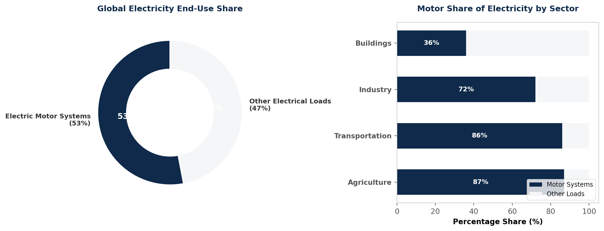

The following table summarizes key energy statistics and the operational scale of electric motors:

| Indicator | Value | Detailed Sector / Context | Data Source |
|---|---|---|---|
| **Global Electricity Consumption Share** | **53%** | All electric motor-driven systems (MDS) combined | IEA 4E EMSA 2025 [1] |
| **Electricity Share in Industry** | **72%** | Drives for pumps, fans, compressors, conveyors, machine tools | IEA 4E EMSA 2025 [1] |
| **Electricity Share in Agriculture** | **87%** | Irrigation pumps, grinders, agricultural processing machinery | IEA 4E EMSA 2025 [1] |
| **Electricity Share in Transportation** | **86%** | Electric Vehicles (EVs), high-speed rail, subways | IEA 4E EMSA 2025 [1] |
| **Electricity Share in Buildings** | **36%** | HVAC systems, elevators, water pumps, cooling compressors | IEA 4E EMSA 2025 [1] |
| **Industrial Rotating Equipment Share** | **85%** | Squirrel-cage induction motors (IM) | Bangash et al. [2] |
| **Industrial Electricity Share for IMs** | **>60%** | Mechanical work supplied by induction machines | Bangash et al. [2] |
| **Reliability Survey Sample Size** | **114,100 motors**| Collected across 75 heavy industrial plants | Dehnavi & Shafiee [1] |
| **Average Motor Density** | **1,521 motors/plant**| Indication of extreme industrial dependence on motors | Dehnavi & Shafiee [1] |

> [!NOTE]
> Even with steady efficiency improvements (transitioning from IE1/IE2 to IE3, IE4, and IE5 standards), global motor electricity demand **is projected to double by 2040** due to rapid industrial automation and the mass transition to Electric Vehicles (EVs). Nurturing motor reliability is thus a global priority.

---

### 🏭 2.2 Applications by Sector and Technology Market Share

Electric motors drive a vast array of systems, ranging from low-power consumer applications to heavy industrial machinery and modern transport traction systems.

The electricity consumption by load application type in Motor-Driven Systems (MDS) and the global market shares of primary motor technologies (Induction Motors, PMSMs, and others like BLDC, DC, EESM) are shown below:

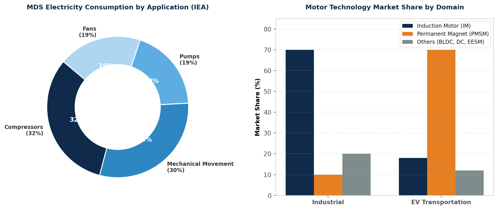

#### 1. Electricity Consumption by Application Type (MDS End-Use):
*   **Hệ thống Turbomachinery (Bơm, Quạt, Máy nén khí):** These account for **70% of all motor-system energy usage** (representing roughly 37% of global electricity consumption).
    *   **Compressors:** Consume **32%** of motor energy. This includes industrial air compressors, commercial refrigeration, and cooling compressors in HVAC systems.
    *   **Pumps:** Consume **19%** of motor energy. These are critical in water treatment plants, cooling water circulation loops, and chemical/petroleum pipelines.
    *   **Fans:** Consume **19%** of motor energy. These drive industrial blowers, boiler exhaust fans, ventilation systems, and cooling towers.
*   **Mechanical Movement Systems:** Consume **30%** of motor energy. This encompasses material handling conveyors, elevators, mills, mixers, crushers, and CNC machining spindles.

#### 2. Motor Technology Market Share by Domain:
Industrial decarbonization and efficiency mandates (IE4/IE5 standards) are reshaping the market distribution of motor technologies:
*   **Industrial Domain (Sales Volume and Installed Base):**
    *   **AC Induction Motors (IM):** Command **70%** of the installed base and approximately 45% of global market revenue. Due to their low cost, robust construction, and direct-on-line (DOL) operating capability, squirrel-cage induction motors remain the workhorse for standard pumps, fans, and conveyors.
    *   **Permanent Magnet Synchronous Motors (PMSM):** Account for **10%** of the industrial market but represent the fastest-growing segment (CAGR ~10-11%). PMSMs are crucial for meeting IE5 efficiency requirements and driving high-precision machinery (e.g., servo drives in CNCs and robotics).
    *   **Others (BLDC, DC, SRM):** Account for **20%** of the market, primarily in light automation, consumer appliances, and legacy speed-controlled DC drives.
*   **EV Transportation Domain (Traction Motors):**
    *   **PMSM:** Dominates with approximately **70%** of the electric vehicle traction market. PMSMs are preferred in passenger EVs due to their superior torque-to-weight ratio, high power density, and high efficiency in urban stop-and-go driving profiles.
    *   **AC Induction Motors (IM):** Account for **18%** of the traction market. They are commonly used as auxiliary motors on secondary axles (e.g., in dual-motor AWD systems) because they do not suffer from magnetic drag (no back-EMF) when unexcited during highway cruising.
    *   **Others (EESM - Electrically Excited Synchronous Motor, SRM):** Account for **12%** of the market. Automakers like BMW and Renault use EESMs to eliminate dependencies on rare-earth permanent magnets.

---

## 3. Physical Mechanisms of Faults (How They Fail)

To develop reliable diagnostic algorithms, one must understand the underlying physics of degradation for each major motor component.

### 📊 3.1 Statistical Distribution of Faults

Developing an effective predictive maintenance (PdM) strategy requires understanding the statistical probability of failures across different motor subcomponents. Two of the most extensive and authoritative industrial reliability databases are the **IEEE Std 493 (Motor Reliability Working Group)** survey and the **EPRI (Electric Power Research Institute)** study.

The chart below compares the failure distribution from these two studies, highlighting the primary physical fault zones of electric motors:

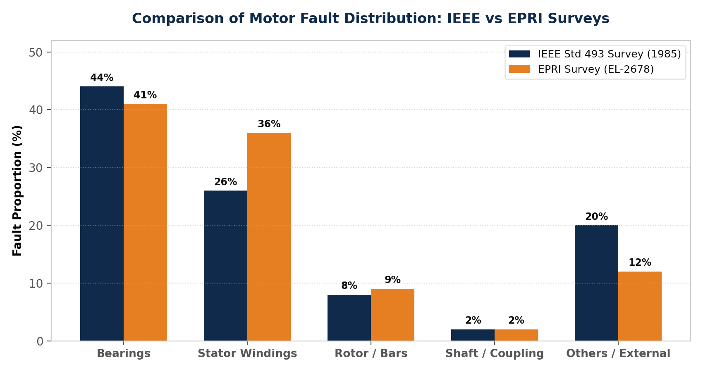

The table below provides a detailed breakdown of failure categories, physical causes, and optimal diagnostic modalities:

| Fault Category (Component) | IEEE Std 493 Share (%) | EPRI Share (%) | Primary Degradation & Physical Mechanisms | Most Sensitive Sensor Channel |
|---|---|---|---|---|
| **Bearing Faults** | **44%** | **41%** | Subsurface Hertzian fatigue, lubrication starvation, abrasive wear, shaft EDM currents causing fluting | Vibration (acceleration), Acoustic Emission (AE), Temperature |
| **Stator Winding Faults** | **26%** | **36%** | Insulation degradation due to TEAM stresses, turn-to-turn (ITSC) or coil-to-coil (ICSC) short circuits | Negative-sequence current, Leakage flux, High-frequency VFD PD |
| **Rotor / Bar Faults** | **8%** | **9%** | Broken rotor bars (BRB), end-ring cracking due to startup thermal stress and cyclic Lorentz forces | Stator current (MCSA sidebands $(1\pm2s)f_s$) |
| **Shaft / Coupling Faults** | **2%** | **2%** | Parallel/angular misalignment, dynamic imbalance, shaft bending, fatigue cracking | Vibration (displacement/velocity at $1f_s, 2f_s$) |
| **Others & External Factors** | **20%** | **12%** | Power supply anomalies (phase imbalance, harmonics), environmental contamination, overload | Power quality monitoring, Ambient sensors |

#### In-Depth Comparison of IEEE Std 493 vs. EPRI Statistics:

1.  **Sample Size and Baseline Failure Rates:**
    *   **IEEE Std 493 (1985):** Surveyed **1,141 failed motors** out of a total population of over **114,100 motors** across 75 industrial facilities. The average failure rate was reported at **0.0708 failures per unit per year**.
    *   **EPRI Survey (EL-2678):** Focused on larger industrial motors rated at **100 HP and above**, tracking **6,105 motors** in utilities and heavy industries. The average failure rate was significantly lower at **0.035 failures per unit per year**. This lower rate reflects the fact that larger, high-value motors are typically built with higher safety margins, subjected to stricter QA/QC, and managed under rigorous preventive maintenance schedules compared to the general population of smaller motors in the IEEE survey.
2.  **The Stator Failure Gap:**
    *   Stator winding failures represent **36%** of all faults in the EPRI survey, compared to only **26%** in the IEEE database. This 10% discrepancy is directly tied to the motor class surveyed. The EPRI study targeted medium-voltage (MV) and high-voltage (HV) motors ($3.3\text{ kV}$, $6.6\text{ kV}$, or $11\text{ kV}$). 
    *   High-voltage stator windings experience much higher electric field stresses, leading to partial discharge (PD) within the insulation voids. Furthermore, large motors experience significant thermal cycling, accelerating the mechanical breakdown of the winding insulation. 
    *   In contrast, the IEEE dataset is dominated by low-voltage (LV) auxiliary motors, where bearing mechanical failures dominate, and stator insulation is less exposed to high-voltage electrical stresses.

---

### 🔍 3.2 Physical Mechanisms of Specific Faults

#### 3.2.1 Bearing Faults

##### How they fail:
Bearings support the radial and axial loads of the rotating shaft. Mechanical failure typically progresses through the following physical stages:
1.  **Subsurface Hertzian Contact Fatigue:** Repetitive compressive stresses at the contact point between the rolling elements and the races induce micro-cracks beneath the metal surface. These micro-cracks eventually propagate to the surface, causing microscopic pitting.
2.  **Spalling/Flaking:** As micro-cracks coalesce, small flakes of metal break away from the raceway or rolling elements, creating localized, sharp physical defects.
3.  **Lubrication Failure:** Dislodged metallic particles act as abrasive contaminants. They break down the thin elastohydrodynamic lubrication (EHL) film, increasing metal-to-metal contact, localized friction, and operating temperatures, which accelerates wear.
4.  **Shaft Currents (EDM Currents):** In motors driven by Variable Frequency Drives (VFDs), high-frequency common-mode voltages induce currents that flow through the bearing oil film. This micro-arcing melts the metal surface, creating parallel fluting ridges along the raceways, leading to rapid bearing destruction.

When a rolling element strikes a localized raceway defect, it generates a high-frequency, periodic mechanical shock. The repetition frequency of these impacts is determined by the bearing geometry and shaft speed:

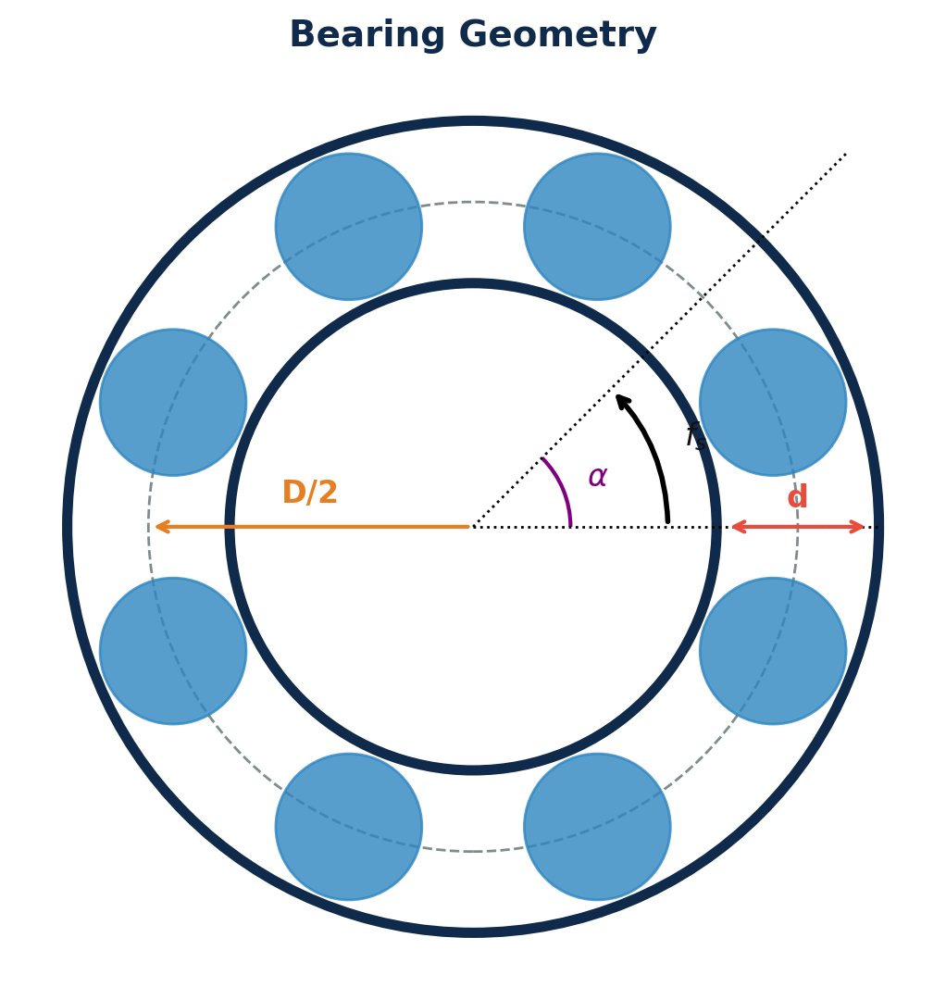

The characteristic bearing defect frequencies are calculated using the following equations:

*   **Ball Pass Frequency Outer Race (BPFO):**
    $$f_{BPFO} = \frac{N_b}{2} f_s \left(1 - \frac{d}{D}\cos\alpha\right)$$
*   **Ball Pass Frequency Inner Race (BPFI):**
    $$f_{BPFI} = \frac{N_b}{2} f_s \left(1 + \frac{d}{D}\cos\alpha\right)$$
*   **Ball Spin Frequency (BSF):**
    $$f_{BSF} = \frac{D}{2d} f_s \left(1 - \left(\frac{d}{D}\cos\alpha\right)^2\right)$$
*   **Fundamental Train Frequency (FTF - Cage Frequency):**
    $$f_{FTF} = \frac{1}{2} f_s \left(1 - \frac{d}{D}\cos\alpha\right)$$

Where:
*   $f_s$: Shaft rotational frequency (Hz).
*   $N_b$: Number of rolling elements (balls).
*   $d$: Rolling element (ball) diameter.
*   $D$: Pitch diameter.
*   $\alpha$: Contact angle.

> [!WARNING]
> Inadequate lubrication is the leading cause of bearing failure, significantly compressing the time window between defect initiation and catastrophic failure, especially under variable-speed operation.

---

#### 3.2.2 Stator Winding Faults: Turn-to-Turn (ITSC) vs. Coil-to-Coil (ICSC)

Stator winding insulation degradation is driven by the synergistic action of four stresses, known as the **TEAM** factors (Thermal, Electrical, Ambient, and Mechanical).

##### How they fail:

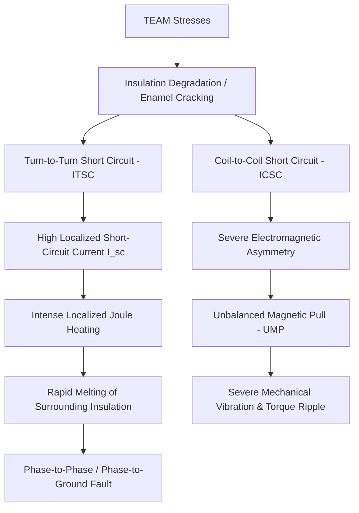

1.  **Thermal Stress and Thermal Cycling:** Continuous overload or starting transients cause rapid temperature rises in the stator windings. The differential thermal expansion between the copper conductors and the stator steel core induces mechanical shear stresses that crack the thin wire insulation enamel. According to the Arrhenius rate law, the thermal life of winding insulation is halved for every $10^\circ C$ increase above its thermal class limit.
2.  **Electromagnetic Forces:** The current flowing through the windings generates Lorentz forces, causing the conductors to vibrate at twice the supply frequency ($2f_s$). Over time, this micro-vibration wears away the insulation enamel.
3.  **VFD Transient Voltage Spikes:** High-frequency pulse-width modulated (PWM) voltage waveforms from VFDs exhibit very high rates of voltage rise ($dv/dt > 10\ \text{kV}/\mu\text{s}$). Slipped cable wave reflections cause transient overvoltages at the first turns of the winding, initiating partial discharge (PD) that degrades the insulation.

##### Comparison of ITSC and ICSC Physical Mechanisms:
*   **Turn-to-Turn Short Circuit (ITSC):** Occurs within **a single coil**. When the insulation between adjacent turns fails, a closed loop is formed. The induced EMF in the shorted loop ($E_{loop}$) is low, but because the loop resistance ($R_{loop}$) is extremely low, the circulating short-circuit current ($I_{sc}$) is very high:
    $$I_{sc} = \frac{E_{loop}}{R_{loop} + j\omega L_{loop}}$$
    This current $I_{sc}$ can reach **5 to 10 times** the nominal motor current, creating intense localized Joule heating ($P = I_{sc}^2 R_{loop}$). This heat melts the surrounding insulation, triggering a chain reaction that quickly escalates into a phase-to-phase or phase-to-ground fault.
*   **Coil-to-Coil Short Circuit (ICSC):** Occurs between **different coils** of the same phase or different phases. ICSC effectively bypasses one or more entire coils, abruptly reducing the effective number of turns in the affected phase ($N_{eff} \ll N_{nominal}$). 
    This generates a severe electromagnetic asymmetry, producing an **Unbalanced Magnetic Pull (UMP)** on the rotor. The UMP bends the shaft, overloading the bearings and causing severe torque ripple at twice the slip frequency:
    $$T_{ripple} \propto I_a^2 + I_b^2 + I_c^2 \quad (\text{under unbalanced current conditions})$$

The schematic below illustrates the electrical equivalent circuits for both stator fault configurations:

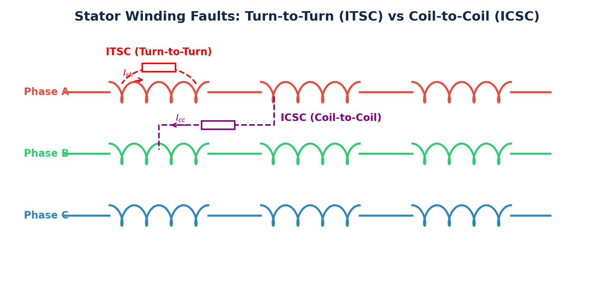

##### Diagnostic Methods and Signal Sensitivity:
*   **For ITSC:** In its early stages (e.g., 1-2 shorted turns out of hundreds), the fault has negligible impact on phase currents or vibration. The most sensitive indicator is the negative-sequence current component ($I_{negative}$):
    $$I_{negative} = \frac{1}{3} (I_a + a^2 I_b + a I_c) \quad \text{where } a = e^{j2\pi/3}$$
*   **For ICSC:** Because of the strong UMP and mechanical forces, **vibration signals** are highly effective for diagnosis. The UMP induces distinct harmonics in the vibration spectrum:
    $$f_{vibration\_fault} = 2k \cdot f_s \pm f_r$$
    *Abdelrahem et al. (2025) [7]* demonstrated that a hybrid **LeNet-5-LSTM** deep learning model trained on multi-axis vibration signals can diagnose ICSC faults with an accuracy of **99.57%**, showcasing the sensitivity of mechanical vibration to electromagnetic faults.

---

#### 3.2.3 Broken Rotor Bars (Broken Rotor Bar — BRB)

##### How they fail:
The squirrel-cage rotor of an induction motor consists of conducting bars short-circuited at both ends by end-rings. These bars are subjected to high thermal, mechanical, and electromagnetic stresses.
1.  **High Starting Currents and Thermal Gradients:** During direct-on-line (DOL) startup, the rotor current can reach **5 to 7 times** the nominal current. Due to the skin effect, the current concentrates at the top of the rotor bar near the air-gap, creating a steep temperature gradient along the bar's depth. The top of the bar expands more than the bottom, placing a severe bending stress on the bar-to-end-ring joint.
2.  **Cyclic Electromagnetic Forces:** Under normal operation, the rotor bars experience cyclic forces at twice the slip frequency ($2s f_s$) due to the interaction of the rotor current and the stator magnetic field.
3.  **Fatigue Cracking:** The combination of thermal expansion stress and cyclic mechanical bending leads to metal fatigue. Cracks typically initiate at the high-stress joint between the bar and the end-ring, eventually causing a complete break.

##### Current Redistribution:
When a rotor bar breaks, the current through that bar drops to zero ($I_{bar} = 0$). This current is forced to redistribute, flowing through the end-ring segments into the **adjacent healthy bars** (e.g., Bar 2 and Bar 4 in the diagram below).

This current diversion increases the current in adjacent bars by 1.5 to 2 times, causing localized thermal overloading that accelerates fatigue and leads to sequential bar failures.

The rotor cage schematic below illustrates the path of current redistribution when a bar breaks:

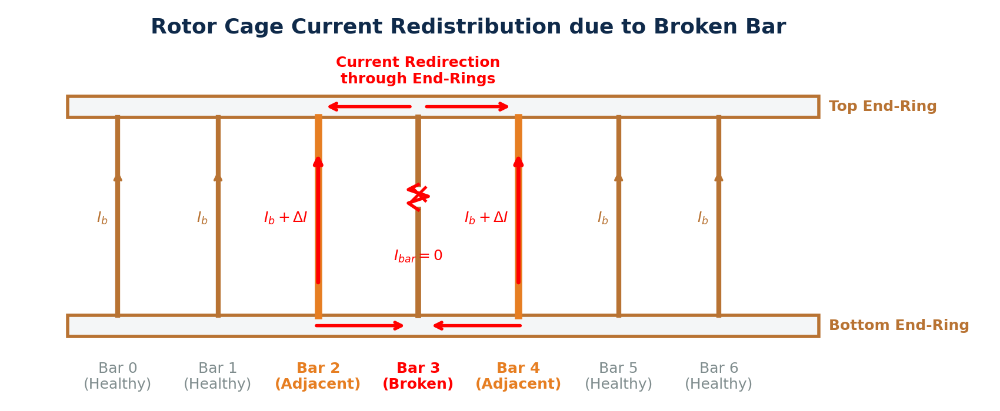

The rotor asymmetry creates a backward-rotating magnetic field at slip frequency ($s \cdot f_s$) relative to the rotor. This field induces sideband components in the stator currents at frequencies surrounding the supply frequency:

$$f_{BRB} = (1 \pm 2ks) \cdot f_s$$

Where:
*   $s$: Slip ($s = \frac{n_{sync} - n_m}{n_{sync}}$).
*   $f_s$: Supply frequency (Hz).
*   $k = 1, 2, 3, \dots$ (the first-order sidebands at $k=1$, $(1\pm 2s)f_s$, are the most prominent).

The difference in the MCSA spectrum between a healthy motor and a motor with broken rotor bars is illustrated below:

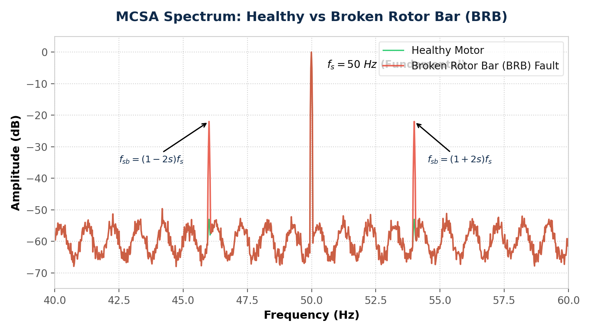

> [!WARNING]
> The amplitude of the BRB sidebands is highly dependent on motor load. Under light load (where slip $s$ is very small), these sidebands merge with the main $50\text{ Hz}$ supply peak and can be **masked by spectral leakage**, presenting a key limitation of classic MCSA.

---

#### 3.2.4 Air-Gap Eccentricity & Shaft Misalignment

##### 1. Stator-Rotor Air-Gap Eccentricity
Air-gap eccentricity refers to a condition where the air-gap between the stator inner diameter and the rotor outer diameter is non-uniform. This is defined by the spatial relationship between three mechanical centers:
*   $O_s$: Geometric center of the stator bore.
*   $O_r$: Geometric center of the rotor.
*   $O_w$: Center of rotation (defined by the bearing axis).

Based on the alignment of these centers, eccentricity is classified into three types:
*   **Concentric (Healthy):** All three centers coincide ($O_s = O_r = O_w$). The air-gap is uniform and constant.
*   **Static Eccentricity (SE):** The rotor center and rotation center coincide, but are offset from the stator center ($O_s \neq O_r = O_w$). The rotor rotates about its own center, but the axis of rotation is offset. The position of minimum air-gap ($g_{min}$) is **fixed in space** and does not rotate.
*   **Dynamic Eccentricity (DE):** The rotation center coincides with the stator center, but the rotor center is offset ($O_s = O_w \neq O_r$). The rotor rotates about the stator center axis, but because the rotor body itself is eccentric, the minimum air-gap position ($g_{min}$) **rotates with the rotor** at rotor speed $\omega_r$.
*   **Mixed Eccentricity (ME):** The realistic case where both static and dynamic eccentricity co-exist:
    $$g(\theta, t) = g_0 [1 - \epsilon_s \cos(\theta - \phi_s) - \epsilon_d \cos(\theta - \omega_r t - \phi_d)]$$

Where $\epsilon_s = e_s / g_0$ and $\epsilon_d = e_d / g_0$ are the static and dynamic eccentricity indexes ($e_s, e_d$ are the physical offsets, $g_0$ is the nominal air-gap).

The spatial centers and air-gap variations for these configurations are illustrated below:

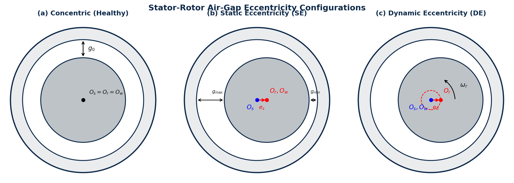

##### 2. Shaft Misalignment
Shaft misalignment occurs when the rotational axes of two coupled shafts (e.g., motor and pump) are not collinear.
*   **Parallel Offset Misalignment ($e_p$):** The shafts are parallel but their centerlines are offset by a distance $e_p$. This generates high radial forces on the bearings at twice the rotational frequency ($2f_s$).
*   **Angular Misalignment ($\theta$):** The shafts intersect at an angle $\theta$ at the coupling center. This generates significant axial forces and bending moments at the rotational frequency ($1f_s$).

These misalignment configurations are illustrated below:

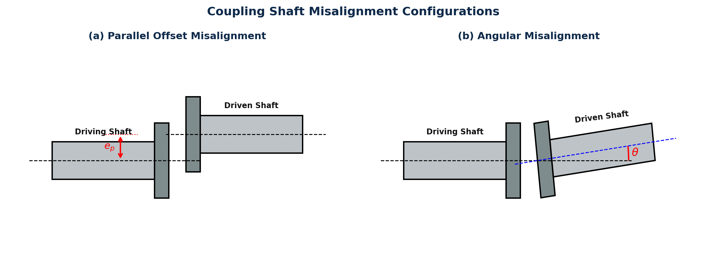

---

## 4. Consequences of Motor Failures

Motor failures propagate through industrial processes, generating substantial direct economic damage, operational disruption, and environmental or safety risks.

### ⏱️ 4.1 Downtime Analysis

Unplanned motor failures trigger an immediate halt in dependent processes, kicking off a costly recovery lifecycle:

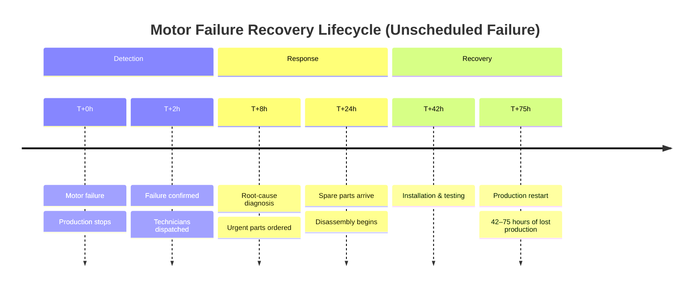

> [!WARNING]
> **42 to 75 hours of downtime per failure** — according to IEEE Standard 493 [1]. In continuous industries (e.g., petrochemicals, food processing, glass manufacturing), a single unscheduled shutdown can **ruin an entire product batch**, damage upstream machinery, and violate environmental safety thresholds.

---

### 💰 4.2 Comprehensive Cost Analysis

The total cost of a motor failure is the sum of direct replacement costs, indirect process losses, and safety liabilities:

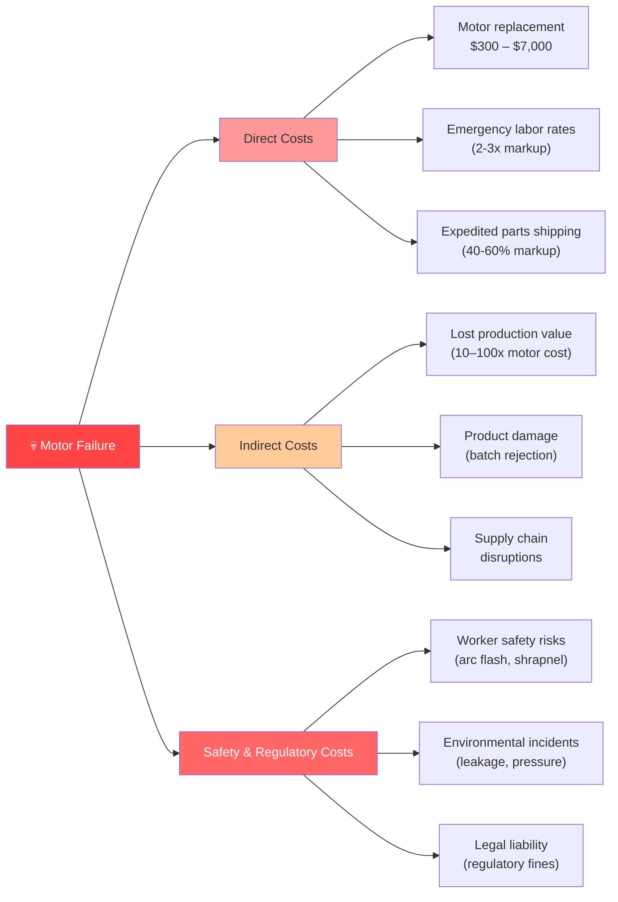

The table below contrasts different maintenance strategies, highlighting why industries are adopting predictive frameworks:

| Maintenance Strategy Comparison | Run-to-Failure (Reactive) | Preventive (Time-Based) | Predictive (PdM / Condition-Based) |
|---|---|---|---|
| **Relative Lifecycle Cost** | Very High (1.0×) | Medium (0.6×) | **Low (0.25–0.4×)** |
| **Asset Downtime** | High (unplanned, catastrophic) | Medium (scheduled PM shutdowns) | **Low (short, scheduled on demand)** |
| **Safety and Incident Risk** | High | Medium | **Low** |
| **Data & Sensor Requirements** | None | Low | **High (continuous CM data)** |
| **Technology Dependency** | Low | Low | High (IoT sensors, Edge/Cloud AI) |

---

## 5. The Critical Importance of Early Fault Detection

### 🔬 5.1 PHM (Prognostics & Health Management) Framework

Condition Monitoring (CM) and Prognostics form the core of modern industrial PHM systems. The typical information flow progresses from sensor data acquisition to automated maintenance actions:

```mermaid
flowchart LR
    subgraph SENSORS["🔌 Sensors"]
        V["⚡ Current\n(MCSA)"]
        A["📳 Vibration\n(Accelerometer)"]
        S["🔊 Acoustic\n(Microphone)"]
        T["🌡️ Temperature\n(RTD/Thermocouple)"]
        X["⚡ Voltage\n(Voltage Sensor)"]
    end
    
    subgraph PHM["📊 PHM Framework"]
        F1["F₁ Fault Detection\n(Healthy / Faulty?)"]
        F2["F₂ Fault Isolation\n(Bearing? Stator? Rotor?)"]
        F3["F₃ Fault Identification\n(ITSC? BRB? BPFO?)"]
        F4["F₄ Severity Estimation\n(1%? 10%? 30%?)"]
        F5["F₅ RUL Prediction\n(How much time left?)"]
    end
    
    subgraph ACTION["🔧 Action"]
        M["Scheduled Maintenance"]
    end
    
    SENSORS --> PHM
    F1 --> F2 --> F3 --> F4 --> F5 --> ACTION
    
    style F1 fill:#e8f5e9
    style F2 fill:#e3f2fd
    style F3 fill:#fff3e0
    style F4 fill:#fce4ec
    style F5 fill:#f3e5f5
    style ACTION fill:#4caf50,color:#fff
```

---

### 📈 5.2 Intervention Window and Fault Evolution

As a motor degrades, the timeline from fault initiation to failure exhibits distinct stage-by-stage symptoms and rising repair costs:

| Degradation Stage | Physical Symptoms & Description | Primary Detection Methods | Relative Intervention Cost |
|---|---|---|---|
| **Latent** (0–5%) | Micro-structural damage, no external symptoms. | Ultrasonic Acoustic Emission, Deep AI models | Very Low ($) |
| **Early** (5–20%) | Weak fault signatures. No thermal or auditory changes. | High-frequency vibration, MCSA, current negative-sequence | Low ($$) |
| **Medium** (20–60%) | Clear, diagnostic signatures. Minor noise/vibration. | Standard vibration spectra, dynamic modeling | Medium ($$$) |
| **Critical** (60–90%) | High heat, severe vibration, audible noise. | Temperature RTDs, handheld thermal cameras, audio | High ($$$$) |
| **Catastrophic** (>90%) | Winding burnout, locked rotor, structural failure. | All sensors (too late to save) | Very High ($$$$$) |

> [!TIP]
> **The Golden Rule of PdM:** Intervening during the early stage (5–20% degradation) yields a **10× to 40× reduction in repair and downtime costs** compared to waiting for critical or catastrophic failure.

---

## 6. Why Motor Fault Diagnosis is Challenging (Technical Bottlenecks)

Diagnosing electric motor faults in actual industrial environments remains a highly complex task due to a series of physical, operational, and data constraints.

### 🔍 6.1 Detailed Analysis of 10 System Challenges

*   **CH1 — Low Signal-to-Noise Ratio (Low SNR):** Incipient-stage bearing defects release minute amounts of energy (on the scale of micro-Joules per impact). The resulting vibration and acoustic emission signatures are typically drowned out by background factory noise, structural floor vibrations, and neighboring machinery. Extracting these weak signals requires computationally expensive filtering algorithms (e.g., Wavelet transforms or Variational Mode Decomposition).
*   **CH2 — Non-Stationary Signals under Variable Speed/Load:** Modern motors frequently operate with Variable Frequency Drives (VFDs) where the shaft speed ($f_r$) is continuously adjusted. When $\frac{d f_r(t)}{dt} \neq 0$, the characteristic fault frequencies slide across the spectrum, causing "spectral smearing." This violates the stationarity assumption of standard fast Fourier transforms (FFT), rendering them ineffective.
*   **CH3 — Structural Domain Shift:** Every motor installation has a unique Frequency Response Function ($H_{FRF}(f)$) governed by bệ đỡ (baseplates), casing geometry, and sensor mounting. The observed sensor signal $Y(f)$ is a filtered version of the raw physical fault source $X_{fault}(f)$:
    $$Y(f) = H_{FRF}(f) \cdot X_{fault}(f)$$
    As a result, a diagnostic model trained on one machine will drop significantly in accuracy when deployed on an identical motor elsewhere due to this domain shift.
*   **CH4 — Extreme Data Imbalance:** In production plants, machines are operated in healthy states for more than 99% of their lifespan. Actual fault data is extremely scarce. This extreme imbalance causes deep learning models to become biased toward the healthy class, leading to false negatives (missed faults) during operation.
*   **CH5 — Practical Label Scarcity:** It is practically impossible to pinpoint the exact millisecond when a micro-crack begins in a bearing or rotor bar under operational conditions. Without precise time-stamps, supervised machine learning models cannot be trained effectively on real industrial datasets.
*   **CH6 — Sensor Vulnerability & Missing Modalities:** Sensors deployed in harsh industrial environments (high dust, moisture, temperature) are prone to failures, calibration drifts, or cable disconnections. If a multi-modal diagnostic model lacks a robust gating or imputation mechanism, the loss of a single sensor channel will collapse the system or trigger false alarms.
*   **CH7 — Non-Linear Interactions in Compound Faults:** When multiple faults co-exist (e.g., shaft misalignment leading to bearing wear and stator eccentricity), the resulting sensor signal is not a linear combination of single-fault signatures. Instead, non-linear frequency modulation occurs, producing complex sum-and-difference sidebands that obscure the original features.
*   **CH8 — Sideband Submergence under Light Loads (MCSA Failure):** Under light load conditions, the motor slip is extremely small ($s \approx 0$). In this scenario, the characteristic rotor bar sideband frequencies $(1 \pm 2s)f_s$ move extremely close to the dominant $50\text{ Hz}$ supply peak, getting masked by spectral leakage.
*   **CH9 — Black-Box Interpretability Barriers:** Plant operators are reluctant to stop critical processes based on a black-box AI prediction. Without physical explainability (e.g., mapping back to characteristic frequencies or wave equations), deep learning models face low adoption in high-risk industries.
*   **CH10 — Phase Drift due to Data De-synchronization:** Multi-modal fusion requires sub-microsecond synchronization between channels with widely different sampling rates (e.g., current at $5\text{ kHz}$ and vibration at $50\text{ kHz}$). Any timing jitter or phase drift destroys the cross-modal phase relationships, degrading the fusion model's accuracy.

---

### 📊 6.2 Comparison of Diagnostic Methods

The table below contrasts traditional signal processing techniques against modern machine learning and hybrid frameworks:

| Diagnostic Method | Expert Knowledge | Labeled Data Volume | Diagnostic Accuracy | Physical Explainability | Domain Generalization |
|---|---|---|---|---|---|
| **Classical FFT / MCSA** | High | Low | Medium | High | Low |
| **Wavelet / STFT** | Medium | Low | Medium | Medium | Low |
| **Traditional ML (SVM/RF)** | Medium | Medium | Medium (~96%) | Medium | Medium |
| **1D CNN on Raw Signals** | Low | High | High (~98%) | Low | Medium |
| **Multi-modal CNN Fusion** | Low | Very High | **Very High (99.2%)** | Low | High |
| **Deep Unfolding (IAIUNet)**| Low | Medium | High (98.87%) | **High** | Medium |

---

## 7. Research Trends and Future Directions

### 🗺️ 7.1 PHM Technology Roadmap

The historical evolution and future directions of rotating machinery health monitoring are mapped below:

```mermaid
flowchart TB
    subgraph GEN1["Generation 1 (1980-2000)\nClassical Signal Analysis"]
        G1A["FFT / Spectral Analysis"]
        G1B["MCSA Sideband Analysis"]
        G1C["Envelope Demodulation"]
    end
    
    subgraph GEN2["Generation 2 (2000-2015)\nTraditional Machine Learning"]
        G2A["SVM / kNN / Random Forest"]
        G2B["Handcrafted Features"]
        G2C["Wavelet + Classifier"]
    end
    
    subgraph GEN3["Generation 3 (2015-2022)\nSingle-Modal Deep Learning"]
        G3A["1D CNN on Raw Time-Series"]
        G3B["2D CNN on TF Spectrograms"]
        G3C["LSTM / GRU for Temporal Tracking"]
    end
    
    subgraph GEN4["Generation 4 (2022-2026)\nMulti-Modal Deep Learning"]
        G4A["Multi-sensor Fusion CNNs"]
        G4B["Time-Series Transformers"]
        G4C["Self-Supervised Pre-training"]
        G4D["Domain Adaptation (DANN)"]
        G4E["Dynamic Sparse Conv [14]"]
        G4F["Deep Unfolding Networks [17]"]
    end
    
    subgraph GEN5["Generation 5 (2026+)\nFoundation Models & Physics-AI"]
        G5A["Time-Series Foundation Models\n(Chronos, MOMENT)"]
        G5B["Physics-Informed ML [28]"]
        G5C["CLIP-style Cross-Modal SSL"]
        G5D["Digital Twins + Low-latency Edge AI"]
    end
    
    GEN1 --> GEN2 --> GEN3 --> GEN4 --> GEN5
    
    style GEN1 fill:#e8eaf6
    style GEN2 fill:#e3f2fd
    style GEN3 fill:#e8f5e9
    style GEN4 fill:#fff3e0
    style GEN5 fill:#fce4ec
```

---

### 🏆 7.2 Highlighted Research Results

The table below summarizes state-of-the-art (SOTA) research works addressing the primary bottlenecks in motor diagnostics:

| Study | Methodology | Sensor Modality | Accuracy | Key Contributions |
|---|---|---|---|---|
| **Abdelrahem et al. 2025 [7]** | Hybrid LeNet-5 + LSTM | PMSM Vibration | **99.57%** (ICSC) **99.52%** (ITSC) | Converts 1D vibration signals into 2D grayscale images; successfully classifies multi-severity stator faults across different load conditions. |
| **Bangash et al. 2025 [2]** | Multi-modal CNN Fusion | IM Multi-sensor | **99.2%** (Fused) 96.0% (Single) | Quantifies the reliability gains of multi-sensor fusion over single-channel vibration or current analysis. |
| **Wang et al. 2025 [17]** | IAIUNet-SRC (Deep Unfolding) | PMSM Current | **98.87%** (Noisy) | Combines analytical mathematical equations directly into neural network layers, providing physical interpretability and noise robustness. |
| **Tang et al. 2026 [14]** | Dynamic Sparse Conv ResNet | PMSM/IM Multi-speed | SOTA across 3 benchmarks | Successfully detects incipient turn-to-turn short circuits under highly dynamic, variable-speed profiles. |

---

## 8. Conclusion & Key Takeaways

### 8.1 Conclusion

Electric motors are the foundational drive units of modern industrial society, converting over half of all global electricity into mechanical work. Their ubiquity across manufacturing, public infrastructure, energy networks, and safety-critical transportation systems elevates motor reliability from a routine maintenance concern to a macroeconomic and safety priority.

The literature demonstrates that adopting predictive maintenance (PdM) powered by multi-modal condition monitoring is the most effective way to eliminate catastrophic, unscheduled downtime (which averages 42 to 75 hours per event). The maturation of hybrid deep learning architectures like **LeNet-5-LSTM** [7] and interpretable **Deep Unfolding Networks** [17] has pushed diagnostic accuracy beyond 99%, even for complex electrical faults like inter-coil (ICSC) and inter-turn (ITSC) winding shorts.

---

### 8.2 Key Takeaways

*   **Macroeconomic Impact:** Motor-driven systems consume **53% of global electricity** (rising to **72% in industry**). Unscheduled failures cost between **$10,000 and $100,000 per hour**, typically causing **42 to 75 hours of downtime**.
*   **Primary Fault Zones:** Bearings (**41-44%**) and stator windings (**26-36%**) account for nearly 80% of all failures. The proportion of stator failures increases significantly in high-voltage industrial applications due to steep electrical field stresses.
*   **Fault Physics Contrasts:** 
    *   *ITSC* occurs inside a single coil, causing high localized circulating currents ($I_{sc}$) and rapid insulation melting.
    *   *ICSC* occurs between different coils, reducing the phase turns and creating strong Unbalanced Magnetic Pull (UMP) that triggers severe mechanical vibration.
*   **Sensor Complementarity:** Stator current analysis (MCSA) is highly sensitive to turn-to-turn shorts (ITSC) and broken rotor bars (BRB), while vibration analysis is extremely sensitive to bearing faults and UMP-induced coil-to-coil faults (ICSC).
*   **Diagnostic Bottlenecks:** Industrial deployment remains limited by low signal-to-noise ratios, spectral smearing under variable speeds, closed-loop controller masking, and domain shift across different physical installations.

---

## 9. References

**[1]** V. S. Dehnavi and M. Shafiee, "Fault diagnosis of induction motors using novel measurement techniques and data fusion," *Measurement*, vol. 256, p. 118135, 2025. doi: 10.1016/j.measurement.2025.118135.

**[2]** M. F. Bangash, A. Arif, M. Hanif, A. Khalil, and A. Imran, "AI based multi-signals fault diagnosis of induction motor," *IEEE Access*, 2025. doi: 10.1109/ACCESS.2025.3638716.

**[3]** Ibid. [Fused CNN results: 99.2% (multi-modal) vs. 96% (single-sensor).]

**[4]** M. Zafarani, E. Bostanci, y. Qi, T. Goktas, and B. Akin, "Interturn short-circuit faults in permanent magnet synchronous motors: An extended review and exploratory investigation," *IEEE J. Emerg. Sel. Topics Power Electron.*, vol. 6, no. 4, pp. 2173–2191, 2018. doi: 10.1109/JESTPE.2018.2811538.

**[5]** M. Cheng, J. Hang, and J. Zhang, "Overview of fault diagnosis theory and method for permanent magnet machine," *Chinese Journal of Electrical Engineering*, vol. 1, no. 1, pp. 22–36, 2015.

**[6]** Y. A. Yucesan and F. A. C. Viana, "A physics-informed neural network for wind turbine main bearing fatigue," *Int. J. Prognostics Health Manag.*, vol. 11, no. 1, 2020.

**[7]** M. Abdelrahem, M. Ahsan, and J. Rodriguez, "Enhanced LeNet-5-LSTM-Based Diagnosis of PMSM Stator Faults Using Vibration Signals Across Different Fault Severities," in *2025 IEEE CPERE*, 2025. doi: 10.1109/CPERE65146.2025.11240075.

**[8]** HUST Research Group, "Multi-Modal Fault Diagnosis for Rotating Machines: Problem Analysis, Data, and Tools" *(BAO_CAO_Multimodal_PHM.md)*, HUST Internal Research Document, May 2026.

**[9]** HUST Research Group, "Comprehensive Synthesis: Multi-Modal Processing Foundations, SOTA, and PHM Applications" *(BAO_CAO_TONG_HOP_Multi_Modal_Processing.md)*, HUST Internal Research Document, May 2026.

**[10]** W. T. Thomson and M. Fenger, "Current signature analysis to detect induction motor faults," *IEEE Ind. Appl. Mag.*, vol. 7, no. 4, pp. 26–34, 2001.

**[11]** G. M. Joksimovic and J. Penman, "The detection of inter-turn short circuits in the stator windings of operating motors," *IEEE Trans. Ind. Electron.*, vol. 47, no. 5, pp. 1078–1084, 2000. doi: 10.1109/41.873216.

**[12]** K. Rajamany et al., "Induction motor stator interturn short circuit fault detection exploiting air-gap magnetic flux," *J. Electrical Computer Engineering*, 2019.

**[13]** A. L. O. Vitor, A. Goedtel, S. Barbon Junior, G. H. Bazan, M. F. Castoldi, and W. A. Souza, "Induction motor short circuit diagnosis and interpretation under voltage unbalance and load variation conditions," *Expert Systems With Applications*, vol. 224, p. 119998, 2023. doi: 10.1016/j.eswa.2023.119998.

**[14]** H. Tang, G. Liu, X. Song, Z. Liu, and Q. Chen, "A Novel Dynamic Sparse Convolution Residual Network for Incipient ITSC Fault Diagnosis of Electric Machines," *IEEE Trans. Ind. Electron.*, 2026. doi: 10.1109/TIE.2026.3677581.

**[15]** C. Zhao, W. Shen, E. Zio, and H. Ma, "Multimodal unified generalization and translation network for intelligent fault diagnosis under dynamic environments," *Eng. Appl. Artif. Intell.*, vol. 162, p. 112559, 2025. doi: 10.1016/j.engappai.2025.112559.

**[16]** D. H. C. Martins et al., "COMFAULDA: Composed Fault Dataset for Rotating Machinery," *IEEE DataPort*, 2022. doi: 10.21227/7j5q-2m97.

**[17]** Y. Wang, D. Li, D. Huang, W. Hu, and W. Song, "Iterative Algorithm-Induced Deep-Unfolding Networks for Interpretable Fault Detection of PMSM," *IET Renewable Power Generation*, vol. 19, p. e70062, 2025. doi: 10.1049/rpg2.70062.

**[18]** K. Thomas et al., "Comprehensive Fault Diagnosis of Three-Phase Induction Motors Using Synchronized Multi-Sensor Data Collection," *Scientific Data*, vol. 12, p. 1468, 2025. doi: 10.1038/s41597-025-05437-3.

**[28]** G. E. Karniadakis et al., "Physics-informed machine learning," *Nature Reviews Physics*, vol. 3, pp. 422–440, 2021.
